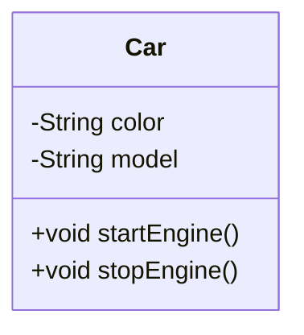
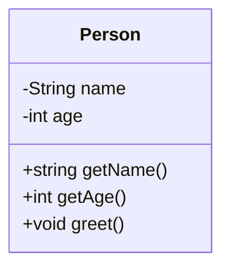
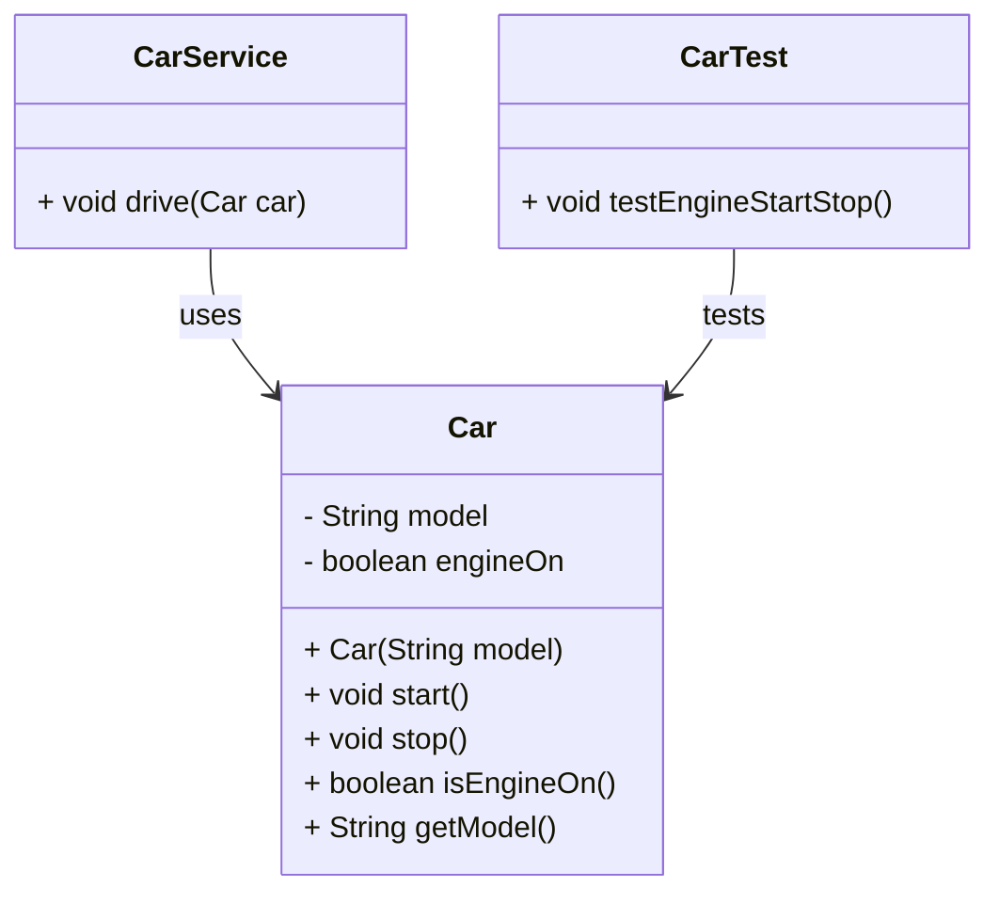

# Conceptos Base

La **Programación Orientada a Objetos (POO)** es un paradigma que organiza el software como una colección de **objetos** que interactúan entre sí. Cada objeto es una **instancia de una clase**, que actúa como plantilla para definir sus atributos (estado) y métodos (comportamiento).

> *“Pensar en objetos es similar a cómo percibimos el mundo: un carro, una persona o una cuenta bancaria tienen características propias y comportamientos definidos”.*

## ¿Qué es una clase?

Una clase es una estructura que define las propiedades (atributos) y capacidades (métodos) que tendrán sus objetos. Es como el plano arquitectónico de una casa.



## ¿Qué es un objeto?

Un **objeto** es una **instancia concreta** de una clase. Si la clase es el plano de una casa, un objeto es una casa construida con ese plano. Tiene valores específicos en sus atributos y puede ejecutar los métodos definidos.

Ejemplo real:

- Clase: `Car`
- Objeto: `myCar = new Car("red", "Toyota")`

## Analogía simple

Piensa en una **receta de cocina (clase)** que describe cómo hacer una torta, y una **torta específica (objeto)** que tú preparas usando esa receta. Cada torta hecha con esa receta puede tener variaciones (ingredientes personalizados), pero todas siguen la misma estructura básica.

## Código en Java de Conceptos Básicos

### Ejemplo básico: Clase `Person`

import Tabs from "@theme/Tabs";
import TabItem from "@theme/TabItem";

<Tabs>
<TabItem value="diagrama" label="Diagrama de Clases">



</TabItem>
<TabItem value="java" label="Ejemplo de Clase">

```java title="Person.java" showLineNumbers
/**
 * Represents a person with a name and age.
 */
public class Person {
    private String name;
    private int age;

    /**
     * Constructs a Person with name and age.
     * @param name The person's name.
     * @param age The person's age.
     */
    public Person(String name, int age) {
        this.name = name;
        this.age = age;
    }

    /** Returns the person's name. */
    public String getName() {
        return name;
    }

    /** Returns the person's age. */
    public int getAge() {
        return age;
    }

    /** Prints a greeting from the person. */
    public void greet() {
        System.out.println("Hi, my name is " + name + " and I'm " + age + " years old.");
    }
}
```

</TabItem>
</Tabs>

### Ejemplo intermedio: modularidad

<Tabs>
<TabItem value="diagrama" label="Diagrama de Clases">



</TabItem>
<TabItem value="java1" label="Representación de Modelo">

```java title="domain/Car.java" showLineNumbers
package domain;

/**
 * Represents a car with model and engine state.
 */
public class Car {
    private String model;
    private boolean engineOn;

    public Car(String model) {
        this.model = model;
        this.engineOn = false;
    }

    public void start() {
        engineOn = true;
    }

    public void stop() {
        engineOn = false;
    }

    public boolean isEngineOn() {
        return engineOn;
    }

    public String getModel() {
        return model;
    }
}
```

</TabItem>
<TabItem value="java2" label="Representación de Servicio">

```java title="application/CarService.java" showLineNumbers
package application;

import domain.Car;

/**
 * CarService manages actions related to a car.
 */
public class CarService {
    public void drive(Car car) {
        if (car.isEngineOn()) {
            System.out.println("Driving the " + car.getModel());
        } else {
            System.out.println("Start the engine first!");
        }
    }
}
```

</TabItem>
<TabItem value="java3" label="Test Unitario">

```java title="test/CarTest.java" showLineNumbers
import domain.Car;
import org.junit.jupiter.api.Test;
import static org.junit.jupiter.api.Assertions.*;

public class CarTest {

    @Test
    void testEngineStartStop() {
        Car car = new Car("Mazda");
        assertFalse(car.isEngineOn());
        car.start();
        assertTrue(car.isEngineOn());
        car.stop();
        assertFalse(car.isEngineOn());
    }
}
```

</TabItem>
</Tabs>

## Diferencias entre Programación Estructurada y Programación Orientada a Objetos

|**Característica**|**Programación Estructurada (PE)**|**Programación Orientada a Objetos (POO)**|
|--|--|--|
|**Paradigma**|Procedural|Basado en objetos|
|**Unidad principal**|Función / procedimiento|Objeto (instancia de clase)|
|**Organización del código**|Secuencia de instrucciones y funciones|Clases que encapsulan datos y métodos|
|**Encapsulamiento**|No está presente|Central: atributos + métodos en la misma clase|
|**Reutilización de código**|Limitada a funciones|Alta, gracias a herencia, composición y polimorfismo|
|**Abstracción**|Bajo nivel (se trabaja con datos directamente|Alto nivel (modelos del mundo real)|
|**Manejo del estado**|Variables globales o locales|Estado mantenido dentro de objetos|
|**Mantenimiento**|Difícil en proyectos grandes|Más organizado, fácil de mantener|
|**Ejemplo típico**|Cálculo de promedio de notas con funciones|Gestión de un curso con objetos `Student`, `Course`, `Teacher`|
|**Lenguajes comunes**|C, Pascal|Java, C++, Python, C#, Kotlin|

Imagina construir una fábrica de autos:

- **PE:** cada empleado tiene instrucciones escritas en papel (funciones separadas); no hay roles ni jerarquía.
- **POO:** cada empleado es parte de un departamento (clase), con tareas claras, roles definidos y comunicación estructurada.

La POO **no reemplaza** a la PE, sino que la extiende y organiza mejor para proyectos grandes y colaborativos. Comprender ambas permite elegir la mejor herramienta según el contexto del problema.

## Mini proyecto: Sistema de Registro de Mascotas

- Clases: `Pet`, `Owner`
- Operaciones: agregar mascota, mostrar datos, cambiar dueño
- Estructura:
  - `edu.usta.domain.Pet`
  - `edu.usta.domain.Owner`
  - `edu.usta.application.PetService`
  - `edu.usta.ui.MainApp`
- Propósito: integrar creación de objetos, encapsulamiento y modularidad básica.

## Reflexión final de Conceptos Base

Principios SOLID aplicados:

- **S:** Person, Car y Pet tienen responsabilidades claras.
- **O:** Las clases están abiertas a extensión (nuevos métodos) sin modificar su implementación.

Patrones aplicados:

- **Entidad (Entity):** Las clases representan conceptos del dominio real.
- **Servicio (Service):** CarService gestiona la lógica de negocio sin modificar la entidad.

## Aplicación práctica de Conceptos Base

- En videojuegos: `Player`, `Enemy`, `Weapon` como clases.
- En sistemas académicos: `Student`, `Course`, `Teacher`.
- En banca: `Account`, `Transaction`, `Customer`.

**Escenario de clase:** Crear un sistema donde cada estudiante crea su propio objeto Book, con atributos title, author y year, y métodos printInfo() y updateYear().

## Recursos y Bibliografía

- Eckel, B. (2006). Thinking in Java. Prentice Hall.
- Oracle. (2024). [Classes and Objects (Java Documentation)](https://docs.oracle.com/javase/tutorial/java/concepts/class.html)
- Horstmann, C. S. (2020). Core Java Volume I–Fundamentals. Pearson Education.
- Baeldung. (2023). [Object-Oriented Programming in Java](https://www.baeldung.com/java-oop)
