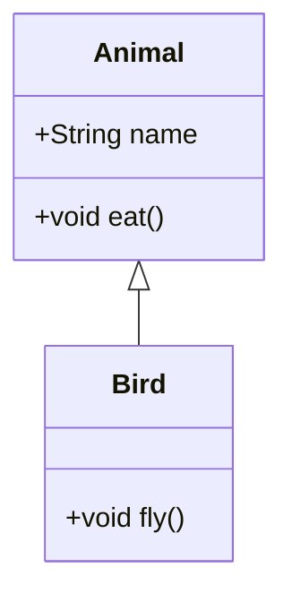
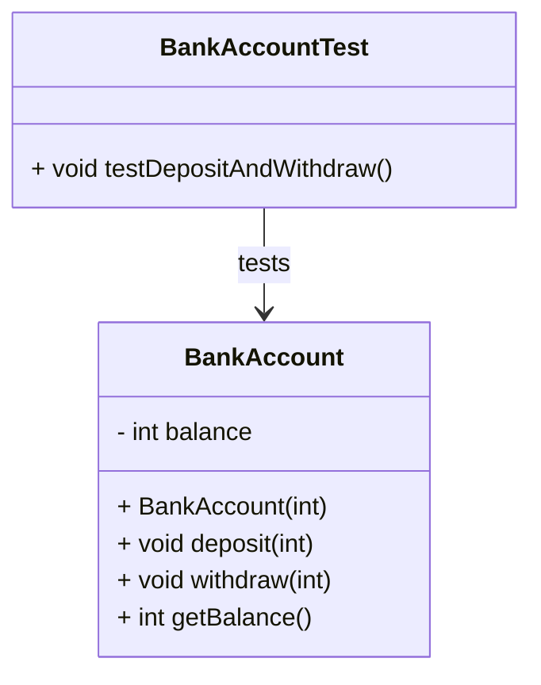
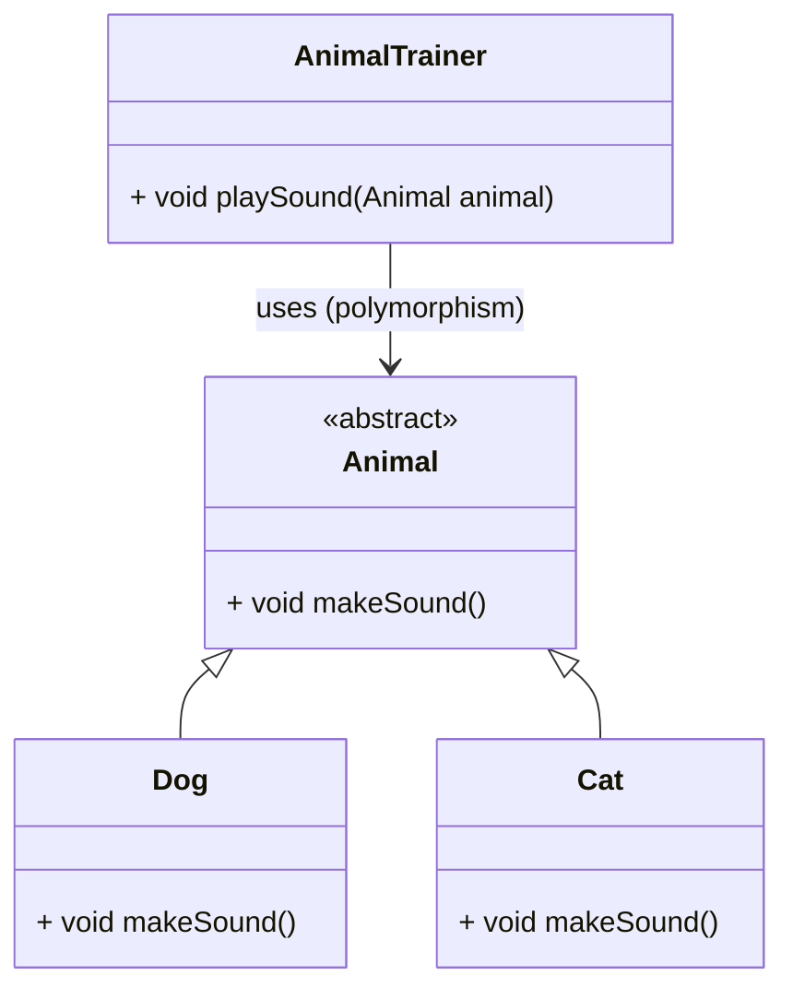

# Introducción a la Programación Orientada a Objetos

La **Programación Orientada a Objetos (POO)** es un paradigma que organiza el software como una colección de **objetos** que interactúan entre sí. Cada objeto es una **instancia de una clase**, que actúa como plantilla para definir sus atributos (estado) y métodos (comportamiento).

> *“Pensar en objetos es similar a cómo percibimos el mundo: un carro, una persona o una cuenta bancaria tienen características propias y comportamientos definidos”.*

## Pilares de la Programación Orientada a Objetos

Los cuatro pilares fundamentales de la Programación Orientada a Objetos son principios que permiten crear sistemas modulares, reutilizables y mantenibles. Cada uno aporta un enfoque estructurado para modelar el comportamiento y las relaciones de los objetos.

### Encapsulamiento

*Definición:* Consiste en **ocultar los detalles** internos de un objeto, exponiendo solo lo necesario mediante métodos públicos. Protege el estado interno del objeto.

*Ejemplo real:* Un cajero automático oculta su lógica interna. Tú solo usas su interfaz (pantalla y botones).

*Beneficio:* Reduce el acoplamiento y permite cambiar la implementación sin afectar el exterior.

### Abstracción

*Definición:* Se refiere a **mostrar solo lo relevante** del objeto, ocultando los detalles innecesarios para el usuario.

*Ejemplo real:* Para conducir un carro no necesitas saber cómo funciona el motor; solo usas el volante y los pedales.

*Beneficio:* Permite enfocarse en lo esencial del problema, facilitando el diseño y entendimiento del sistema.

### Herencia

*Definición:* Permite que una clase (subclase) **herede atributos y métodos** de otra clase (superclase), evitando duplicación de código.

Ejemplo real: `Bird` hereda de `Animal`, por lo tanto, todos los pájaros son animales.



*Beneficio:* Fomenta la reutilización de código y la jerarquía entre objetos.

### Polimorfismo

*Definición:* Permite que una **misma operación** tenga diferentes comportamientos según el objeto que la ejecute.

*Ejemplo real:* El método `makeSound()` se comporta diferente en `Dog`, `Cat` o `Bird`.

*Beneficio:* Facilita la extensión del sistema sin modificar código existente (Open/Closed Principle).

### Código en Java de Pilares de POO

import Tabs from "@theme/Tabs";
import TabItem from "@theme/TabItem";

#### Ejemplo básico: Encapsulamiento y Abstracción

<Tabs>
<TabItem value="diagrama" label="Diagrama de Clases">



</TabItem>
<TabItem value="java1" label="Modelo">

```java title="BankAccount.java" showLineNumbers
/**
 * Represents a bank account with basic encapsulation.
 */
public class BankAccount {
    private double balance;

    public BankAccount(double initialBalance) {
        this.balance = initialBalance;
    }

    public void deposit(double amount) {
        if (amount > 0) balance += amount;
    }

    public void withdraw(double amount) {
        if (amount <= balance) balance -= amount;
    }

    public double getBalance() {
        return balance;
    }
}
```

</TabItem>
<TabItem value="java2" label="Test Unitario">

```java title="BankAccountTest.java" showLineNumbers
import org.junit.jupiter.api.Test;
import static org.junit.jupiter.api.Assertions.*;

public class BankAccountTest {

    @Test
    void testDepositAndWithdraw() {
        BankAccount acc = new BankAccount(100);
        acc.deposit(50);
        assertEquals(150, acc.getBalance());
        acc.withdraw(40);
        assertEquals(110, acc.getBalance());
    }
}
```

</TabItem>
</Tabs>

#### Ejemplo intermedio: Herencia y Polimorfismo

<Tabs>
<TabItem value="diagrama" label="Diagrama de Clases">



</TabItem>
<TabItem value="java1" label="Clase Padre Abstracta">

```java title="Animal.java" showLineNumbers
package animals;

public abstract class Animal {
    public abstract void makeSound();
}
```

</TabItem>
<TabItem value="java2" label="Clases Hijas">

```java title="Dog.java" showLineNumbers
package animals;

// highlight-next-line
public class Dog extends Animal {
    @Override
    public void makeSound() {
        System.out.println("Woof!");
    }
}
```

```java title="Cat.java" showLineNumbers
package animals;

// highlight-next-line
public class Cat extends Animal {
    @Override
    public void makeSound() {
        System.out.println("Meow!");
    }
}
```

</TabItem>
<TabItem value="java3" label="Clase con aplicación de Polimorfismo">

```java title="AnimalTrainer.java" showLineNumbers
package animals;

public class AnimalTrainer {
    public void playSound(Animal animal) {
        // highlight-next-line
        animal.makeSound(); // Polimorfismo en acción
    }
}
```

</TabItem>
<TabItem value="java4" label="Test Unitarios">

```java title="AnimalTest.java" showLineNumbers
package animals;

import org.junit.jupiter.api.Test;
import java.io.ByteArrayOutputStream;
import java.io.PrintStream;

import static org.junit.jupiter.api.Assertions.assertEquals;

public class AnimalTest {

    @Test
    public void testDogSound() {
        Animal dog = new Dog();
        ByteArrayOutputStream output = new ByteArrayOutputStream();
        System.setOut(new PrintStream(output));

        dog.makeSound();

        assertEquals("Woof!" + System.lineSeparator(), output.toString());
    }

    @Test
    public void testCatSound() {
        Animal cat = new Cat();
        ByteArrayOutputStream output = new ByteArrayOutputStream();
        System.setOut(new PrintStream(output));

        cat.makeSound();

        assertEquals("Meow!" + System.lineSeparator(), output.toString());
    }
}
```

```java title="AnimalTrainerTest.java" showLineNumbers
package animals;

import org.junit.jupiter.api.Test;
import java.io.ByteArrayOutputStream;
import java.io.PrintStream;

import static org.junit.jupiter.api.Assertions.assertEquals;

public class AnimalTrainerTest {

    @Test
    public void testTrainerWithDog() {
        AnimalTrainer trainer = new AnimalTrainer();
        Animal dog = new Dog();

        ByteArrayOutputStream output = new ByteArrayOutputStream();
        System.setOut(new PrintStream(output));

        trainer.playSound(dog);

        assertEquals("Woof!" + System.lineSeparator(), output.toString());
    }

    @Test
    public void testTrainerWithCat() {
        AnimalTrainer trainer = new AnimalTrainer();
        Animal cat = new Cat();

        ByteArrayOutputStream output = new ByteArrayOutputStream();
        System.setOut(new PrintStream(output));

        trainer.playSound(cat);

        assertEquals("Meow!" + System.lineSeparator(), output.toString());
    }
}
```

</TabItem>
</Tabs>

### Mini proyecto: Sistema de Gestión de Animales

- Clases: `Animal` (abstracta), `Dog`, `Cat`, `ZooManager`
- Aplicación del polimorfismo: `ZooManager` recorre una lista de animales y ejecuta `makeSound()`.
- Modularidad por paquetes:
  - `edu.usta.domain` → entidades
  - `edu.usta.application` → servicios
  - `edu.usta.ui` → interfaz de consola

### Reflexión final de Conceptos Base

Principios SOLID aplicados:

- **S – Single Responsibility:** cada clase tiene una única responsabilidad (por ejemplo, `Dog` solo representa un perro).
- **O – Open/Closed:** `AnimalTrainer` está abierto a nuevas clases (Parrot, Tiger) sin ser modificado.
- **L – Liskov Substitution:** `Dog` y `Cat` pueden sustituir a Animal sin alterar la lógica.
- **I – Interface Segregation:** aplicado si se definen múltiples interfaces como `Flyable`, `Swimmable`.
- **D – Dependency Inversion:** si se usan interfaces en vez de clases concretas (ej. `Animal`).

Patrones identificados:

- **Template Method** (en la clase abstracta `Animal`)
- **Strategy** (si se define el sonido como comportamiento independiente)

### Aplicación práctica

- En videojuegos: `Enemy` hereda de `Character`, cada enemigo tiene diferentes estrategias de ataque (`attack()` polimórfico).
- En banca: `Account`, `SavingsAccount`, `CheckingAccount` aplican herencia y polimorfismo.
- En sistemas académicos: `Person`, `Student`, `Teacher`, `printInfo()` se comporta distinto.

**Escenario en clase:** Crear jerarquía de `Vehicle`, `Car`, `Bike`, `Truck` con un método polimórfico `move()`.

## Recursos y Bibliografía

- Eckel, B. (2006). Thinking in Java. Prentice Hall.
- Oracle. (2024). [Classes and Objects (Java Documentation)](https://docs.oracle.com/javase/tutorial/java/concepts/class.html)
- Horstmann, C. S. (2020). Core Java Volume I–Fundamentals. Pearson Education.
- Baeldung. (2023). [Object-Oriented Programming in Java](https://www.baeldung.com/java-oop)
