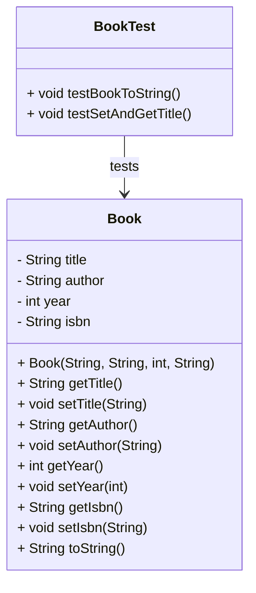
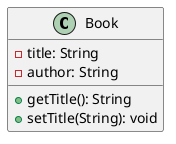
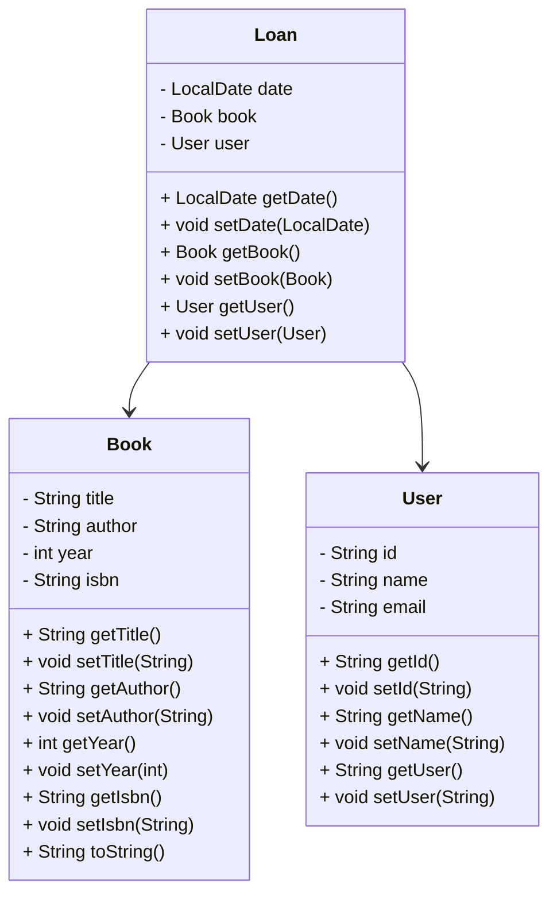
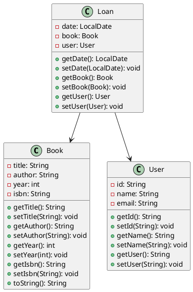

# POJO y UML Básico

## ¿Qué es un POJO?

**POJO (Plain Old Java Object)** es un objeto Java **sencillo y autónomo** que no depende de ninguna tecnología, framework o API externa (como Spring, Hibernate, etc.). Es la forma más limpia y pura de representar una **entidad del dominio**.

Características de un POJO:

- Tiene atributos privados.
- Posee constructores, setters y getters.
- Puede implementar `toString()`, `equals()` y `hashCode()`.
- No extiende de clases específicas ni implementa interfaces no necesarias.

**Ejemplo real:** Representar un libro (`Book`) solo con su título, autor, año y código ISBN.

### Código en Java

import Tabs from "@theme/Tabs";
import TabItem from "@theme/TabItem";

<Tabs>
<TabItem value="diagrama" label="Diagrama de Clases">



</TabItem>
<TabItem value="java1" label="Clase POJO">

```java title="Book.java" showLineNumbers
/**
 * Represents a book entity in a library system.
 */
public class Book {
    private String title;
    private String author;
    private int year;
    private String isbn;

    /**
     * Constructs a new Book with basic information.
     * @param title Title of the book.
     * @param author Author of the book.
     * @param year Year of publication.
     * @param isbn ISBN code of the book.
     */
    public Book(String title, String author, int year, String isbn) {
        this.title = title;
        this.author = author;
        this.year = year;
        this.isbn = isbn;
    }

    public String getTitle() { return title; }
    public void setTitle(String title) { this.title = title; }

    public String getAuthor() { return author; }
    public void setAuthor(String author) { this.author = author; }

    public int getYear() { return year; }
    public void setYear(int year) { this.year = year; }

    public String getIsbn() { return isbn; }
    public void setIsbn(String isbn) { this.isbn = isbn; }

    @Override
    public String toString() {
        return title + " by " + author + " (" + year + ")";
    }
}
```

</TabItem>
<TabItem value="java2" label="Test Unitarios">

```java title="BookTest.java" showLineNumbers
import org.junit.jupiter.api.Test;
import static org.junit.jupiter.api.Assertions.*;

public class BookTest {

    @Test
    void testBookToString() {
        Book book = new Book("Clean Code", "Robert C. Martin", 2008, "9780132350884");
        assertEquals("Clean Code by Robert C. Martin (2008)", book.toString());
    }

    @Test
    void testSetAndGetTitle() {
        Book book = new Book("Title", "Author", 2020, "123");
        book.setTitle("New Title");
        assertEquals("New Title", book.getTitle());
    }
}
```

</TabItem>
</Tabs>

## ¿Qué es UML?

**UML (Unified Modeling Language)** es un lenguaje gráfico que permite **modelar sistemas orientados a objetos**. También podríamos definirlo como un **lenguaje visual estandarizado** para representar la estructura, comportamiento e interacciones de un sistema orientado a objetos.

En la Programación Orientada a Objetos tenemos los siguientes tipos de diagramas UML más comunes:

|Tipo de diagrama|Propósito|
|--|--|
|**Diagrama de clases**|Representar entidades del sistema (clases, atributos, métodos, relaciones)|
|**Diagrama de casos de uso**|Representar interacciones entre actores y el sistema|
|**Diagrama de secuencia**|Modelar la interacción temporal entre objetos|
|**Diagrama de actividades**|Mostrar flujos de trabajo o procesos|

Por ejemplo, en el **diagrama de clases** UML se representan:

- Clases
- Atributos
- Métodos
- Relaciones (asociación, herencia, composición, etc.)

**Símbolos básicos:**

- `+` público
- `-` privado
- `#` protegido
- `~` estático
- `*` multiplicidad (número de instancias)

### ¿Qué es PlantUML?

**PlantUML** es una herramienta que permite crear **diagramas UML mediante código textual**. En lugar de arrastrar y soltar elementos gráficos, el usuario escribe una especie de "lenguaje de marcado" para generar los diagramas automáticamente.

**Ventajas**:

- Ligero y rápido.
- Versionable en Git.
- Compatible con Markdown, Docusaurus y VSCode.
- Ideal para generar documentación automática de código.

Un diagrama en PlantUML se vé de la siguiente manera:



Este código genera una imagen de un diagrama de clase con la clase `Book`, sus atributos y métodos.

Para trabajar con PlantUML en VSCode debes:

1. Tener conexión a internet para renderizado online, o instalar Graphviz para render local.
2. Instalar la extensión "PlantUML" con mayor número de usuarios.
3. Crear un archivo `.puml` o `.plantuml` con el código del diagrama.
4. Presionar **Alt + D** o hacer click derecho y luego seleccionar "Preview Current Diagram".
5. Puedes exportar el diagrama a formato PNG o SVG usando el comando "Export Current Diagram"

## Analogía Básica

1. POJO como un envase limpio y etiquetado

   Imagina que un POJO es como una botella transparente con etiqueta:

   - Contiene un líquido (datos como `title`, `author`, etc.).
   - Tiene tapa (acceso controlado con getters/setters).
   - No hace nada más que **guardar datos de forma ordenada**.
   - No tiene chips, sensores, ni botones (no depende de frameworks ni librerías externas).

   Es una estructura de datos pura, como un frasco que contiene información pero no interactúa con el mundo por sí solo.

2. UML como el plano de una casa

   Antes de construir una casa, necesitas un plano arquitectónico. Este no tiene cemento, ladrillos ni electricidad, pero:

   - Dice dónde estará cada habitación (clase).
   - Qué tendrá dentro (atributos y métodos).
   - Qué puertas conectan una habitación con otra (relaciones entre clases).

   UML no construye el sistema, pero lo visualiza antes de codificarlo.

## Actividad

- Construcción manual de una clase User con atributos básicos (id, name, email).
- Dibujar en grupo el diagrama UML en papel (nombre, atributos, métodos).
- Uso de PlantUML o draw.io para digitalizar el diagrama.

## Mini proyecto: Sistema de Biblioteca (versión POJO)

- Clase `Book`: título, autor, año, ISBN
- Clase `User`: id, nombre, correo
- Clase `Loan`: fecha, libro, usuario

**Reto:** Modelar y construir los tres POJOs + sus UMLs + documentación.

**Pistas:**

- `Loan` debe tener referencias a `Book` y `User`.
- Uso de composición en UML.
  
  ```puml
  @startuml
  class Loan {
      - date: LocalDate
      - book: Book
      - user: User
      + getDate(): LocalDate
      + getBook(): Book
      + getUser(): User
  }
  Loan --> Book
  Loan --> User
  @enduml
  ```

**Resultado:**

<Tabs>
<TabItem value="diagrma" label="Diagrama de Clases">



</TabItem>
<TabItem value="plantUML" label="Código PlantUML">



</TabItem>
<TabItem value="java" label="POJOs - Código Java">

```java title="Book.java" showLineNumbers
package domain;

/**
 * Represents a book in the library system.
 * Each book has a title, an author, a publication year, and an ISBN code.
 * Provides methods to access and modify book details.
 */
public class Book {
    private String title;
    private String author;
    private int year;
    private String isbn;

    /**
     * Constructs a new Book with the specified details.
     *
     * @param title the title of the book
     * @param author the author of the book
     * @param year the year of publication
     * @param isbn the ISBN code of the book
     */
    public Book(String title, String author, int year, String isbn) {
        this.title = title;
        this.author = author;
        this.year = year;
        this.isbn = isbn;
    }

    /**
     * Gets the title of the book.
     * @return the book title
     */
    public String getTitle() {
        return title;
    }

    /**
     * Sets the title of the book.
     * @param title the new title
     */
    public void setTitle(String title) {
        this.title = title;
    }

    /**
     * Gets the author of the book.
     * @return the book author
     */
    public String getAuthor() {
        return author;
    }

    /**
     * Sets the author of the book.
     * @param author the new author
     */
    public void setAuthor(String author) {
        this.author = author;
    }

    /**
     * Gets the publication year.
     * @return the publication year
     */
    public int getYear() {
        return year;
    }

    /**
     * Sets the publication year.
     * @param year the new year
     */
    public void setYear(int year) {
        this.year = year;
    }

    /**
     * Gets the ISBN code.
     * @return the ISBN
     */
    public String getIsbn() {
        return isbn;
    }

    /**
     * Sets the ISBN code.
     * @param isbn the new ISBN
     */
    public void setIsbn(String isbn) {
        this.isbn = isbn;
    }

    /**
     * Returns a string representation of the book.
     * @return formatted book details
     */
    @Override
    public String toString() {
        return title + " by " + author + " (" + year + ") - ISBN: " + isbn;
    }
}

```

```java title="User.java" showLineNumbers
package domain;

/**
 * Represents a user who borrows books.
 * Each user has an ID, a name, and an email address.
 */
public class User {
    private String id;
    private String name;
    private String email;

    /**
     * Constructs a new User with the given data.
     *
     * @param id the unique identifier for the user
     * @param name the name of the user
     * @param email the email address of the user
     */
    public User(String id, String name, String email) {
        this.id = id;
        this.name = name;
        this.email = email;
    }

    /**
     * Gets the user ID.
     * @return the ID
     */
    public String getId() {
        return id;
    }

    /**
     * Sets the user ID.
     * @param id the new ID
     */
    public void setId(String id) {
        this.id = id;
    }

    /**
     * Gets the user's name.
     * @return the name
     */
    public String getName() {
        return name;
    }

    /**
     * Sets the user's name.
     * @param name the new name
     */
    public void setName(String name) {
        this.name = name;
    }

    /**
     * Gets the user's email address.
     * @return the email
     */
    public String getEmail() {
        return email;
    }

    /**
     * Sets the user's email address.
     * @param email the new email
     */
    public void setEmail(String email) {
        this.email = email;
    }
}
```

```java title="Loan.java" showLineNumbers
package domain;

import java.time.LocalDate;

/**
 * Represents a loan (borrowing transaction) in the system.
 * Associates a book and a user with the date of the loan.
 */
public class Loan {
    private LocalDate date;
    private Book book;
    private User user;

    /**
     * Constructs a new Loan with the specified date, book, and user.
     *
     * @param date the date of the loan
     * @param book the borrowed book
     * @param user the user who borrows the book
     */
    public Loan(LocalDate date, Book book, User user) {
        this.date = date;
        this.book = book;
        this.user = user;
    }

    /**
     * Gets the loan date.
     * @return the date
     */
    public LocalDate getDate() {
        return date;
    }

    /**
     * Sets the loan date.
     * @param date the new date
     */
    public void setDate(LocalDate date) {
        this.date = date;
    }

    /**
     * Gets the borrowed book.
     * @return the book
     */
    public Book getBook() {
        return book;
    }

    /**
     * Sets the borrowed book.
     * @param book the new book
     */
    public void setBook(Book book) {
        this.book = book;
    }

    /**
     * Gets the user who borrowed the book.
     * @return the user
     */
    public User getUser() {
        return user;
    }

    /**
     * Sets the user who borrowed the book.
     * @param user the new user
     */
    public void setUser(User user) {
        this.user = user;
    }
}
```

</TabItem>
</Tabs>

## Reflexión final

Principios SOLID aplicados:

- **S – Single Responsibility:** cada POJO representa solo una entidad (sin lógica extra).
- **O – Open/Closed:** se pueden extender funcionalidades sin modificar la clase base.

Patrones aplicados:

- **Value Object:** los POJOs representan datos sin lógica de negocio compleja.
- **Composition:** en Loan, se incluyen objetos Book y User.

## Aplicación práctica

- Sistemas universitarios: `Student`, `Course`, `Enrollment`
- E-commerce: `Product`, `Customer`, `Order`
- Videojuegos: `Character`, `Weapon`, `Inventory`

## Recursos y Bibliografía

- Oracle. (2024). [Creating and Using Plain Old Java Objects (POJO)](https://docs.oracle.com/javaee/6/tutorial/doc/gjbnr.html)
- Ambler, S. W. (2004). The Object Primer: Agile Model-Driven Development with UML 2.0. Cambridge University Press.
- Sitio oficial de [PlantUML](https://plantuml.com/)
- Plugin para VSCode: [PlantUML extension - Visual Studio Marketplace](https://marketplace.visualstudio.com/items?itemName=jebbs.plantuml)
- Documentación de Java para UML: [Oracle Java UML Guide](https://docs.oracle.com/javase/tutorial/extra/)
