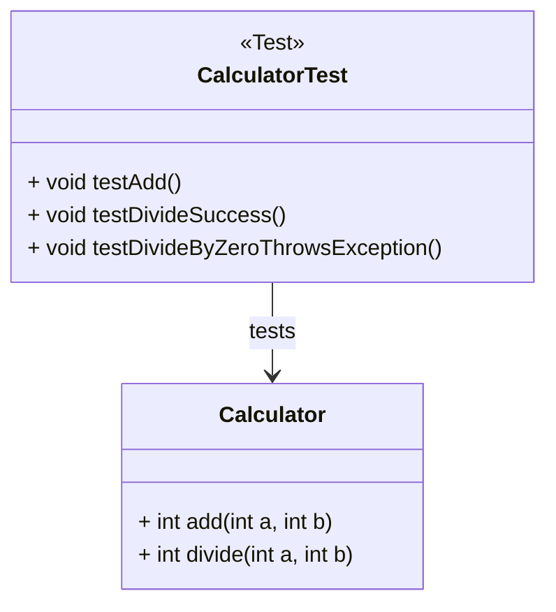

# Unit Testing con JUnit para JDK 21+

## ¿Qué es una prueba unitaria (unit test)?

Una **prueba unitaria** es un fragmento de código que **verifica el comportamiento de una unidad específica** del programa (por lo general, un método). Se ejecuta automáticamente y permite comprobar que el código **funciona correctamente** y **continúa funcionando** después de cambios o refactorizaciones.

> *Una unidad de código = el método más pequeño que tenga lógica.*
>
> *“Una prueba unitaria responde: ¿este método hace lo que debería hacer en todos los casos esperados?”*

## ¿Qué es JUnit 5?

**JUnit 5** es el **framework estándar de testing** en Java, especialmente diseñado para pruebas automatizadas. Es compatible con JDK 8 en adelante y **funciona perfectamente con JDK 21+**.

Características principales:

- Sintaxis moderna con anotaciones.
- Soporte para pruebas parametrizadas.
- Organización por módulos (`junit-jupiter`, `junit-platform`...).
- Compatible con Gradle, Maven y Java puro.

Su arquitectura se basa en tres módulos:

|Componente|Descripción|
|--|--|
|**JUnit Platform**|Motor base para ejecutar pruebas|
|**JUnit Jupiter**|API de anotaciones y aserciones modernas|
|**JUnit Vintage**|Soporte para pruebas antiguas (JUnit 3/4)|

## ¿Por qué aprender testing desde el principio?

|Beneficio|Aplicación educativa|
|--|--|
|Evita errores|Permite detectar fallos tempranos en lógica y diseño|
|Mejora el aprendizaje|Obliga al estudiante a pensar en entradas, salidas y condiciones|
|Facilita el cambio|Los refactorings se validan fácilmente si hay pruebas existentes|
|Profesionaliza el desarrollo|Introduce una práctica estándar de la ingeniería de software|

## Principales anotaciones de JUnit 5

|Anotación|Descripción|
|--|--|
|`@Test`|Marca un método como prueba unitaria|
|`@BeforeEach`|Ejecutado antes de cada test|
|`@AfterEach`|Ejecutado después de cada test|
|`@BeforeAll`|Ejecutado una vez antes de todas las pruebas|
|`@AfterAll`|Ejecutado una vez al final|
|`@DisplayName`|Etiqueta descriptiva del test|

## Instalación de Apache Maven

**Apache Maven** es una **herramienta de gestión de proyectos** y **automatización de builds** para proyectos Java (y otros lenguajes). Permite compilar, empaquetar, probar, documentar y distribuir proyectos de forma **estandarizada** y **reproducible**. Para estos proyectos recomiendo usar Maven por su integración nativa con frameworks de pruebas, ejemplo JUnit 5.

Para su instalación debemos:

### En Windows

1. Ingresar a [Apache Maven - Downloads](https://maven.apache.org/download.cgi) y descargar el archivo `.zip` de la **última versión estable**.
2. Extraer los archivos en una carpeta de tu elección.
3. Acceder a las **variables de entorno** del sistema, en donde añadimos la variable `MAVEN_HOME` apuntando a la ruta de donde extrajiste Maven. Luego, en la variable `PATH` debemos añadir la ruta al directorio `bin` dentro del folder de maven. Ejemplo
   - `MAVEN_HOME`: `C:\Program Files\Apache\Maven\apache-maven-3.9.6
   - `PATH`: `:\Program Files\Apache\Maven\apache-maven-3.9.10\bin`
   - Recomendación: Asegurarse de que tengas la variable `JAVA_HOME` definida (por ejemplo: `C:\Program Files\Java\jdk-21`)
4. Verificar la instalación accediendo a una terminal y ejecutando el comando `mvn -v` en donde te debe indicar la versión de Apache Maven y de Java.

### En macOS

1. Abrir el gestor de paquetes Homebrew y ejecutar: `brew install maven`.
2. Verificar la versión instalada con el comando `mvn -v`

### En Linux

1. Abrir una terminal y ejecutar `sudo apt update` y `sudo apt install maven`.
2. Validar la versión instalada con el comando `mvn -v`

## Manejar un proyecto Java con Apache Maven

Si queremos trabajar un proyecto Java con Maven, debemos seguir los siguientes pasos:

1. Abrir la terminal y crear el proyecto usando el siguiente comando:

   ```bash
   mvn archetype:generate -DgroupId=edu.project -DartifactId=project -DarchetypeArtifactId=maven-archetype-quickstart -DinteractiveMode=false
   ```

2. Ingresa a la ubicación del proyecto, compila y ejecuta el proyecto:

   ```bash
   mvn clean compile exec:java -Dexec.mainClass="edu.project.App"
   ```

3. Si el anterior comando falla entonces debes agregar o validar que se encuentre el plugin `exec-maven-plugin` al `pom.xml`:

   ```xml
   <build>
     <plugins>
       <plugin>
         <groupId>org.codehaus.mojo</groupId>
         <artifactId>exec-maven-plugin</artifactId>
         <version>3.1.0</version>
         <configuration>
           <mainClass>edu.project.App</mainClass>
         </configuration>
       </plugin>
     </plugins>
   </build>
   ```

4. Ahora puedes ejecutar solo el siguiente comando:

   ```bash
   mvn clean compile exec:java
   ```

5. Ejecutar las pruebas unitarias con el siguiente comando:

   ```bash
   mvn test
   ```

## Configuración de JUnit 5 en proyectos Maven con JDK 21+

1. Crear un proyecto con **Maven**
2. Modificar el archivo `pom.xml`. Agregar la dependencia JUnit 5:

   ```xml
   <dependencies>
     <!-- JUnit 5 Jupiter API -->
     <dependency>
       <groupId>org.junit.jupiter</groupId>
       <artifactId>junit-jupiter</artifactId>
       <version>5.10.0</version>
       <scope>test</scope>
     </dependency>
   </dependencies>

   <build>
     <plugins>
       <plugin>
         <groupId>org.apache.maven.plugins</groupId>
         <artifactId>maven-surefire-plugin</artifactId>
         <version>3.1.2</version>
       </plugin>
     </plugins>
   </build>
   ```

3. Ejecutar pruebas: Para ejecutar las pruebas debes asegurarte de que la variable del sistema `JAVA_HOME` está bien configurado. Luego puedes ejecutar el comando `mvn clean test`

En caso de que el paquete `junit-jupiter` no se instale, puedes forzar su descarga usando una terminal en el proyecto y usar el comando `mvn clean compile`, o actualizar las dependencias con `mvn dependency:resolve`, o por último usar `mvn install`.

### Tips adicionales

- Nunca borres la carpeta `.vscode` ni `.mvn` si existe.
- Si el archivo `pom.xml` cambia, guarda el archivo y espera que Maven recargue automáticamente.
- Para forzar la reconstrucción del árbol Maven puedes usar el comando `mvn dependency:purge-local-repository`

## Ejemplo de código con pruebas

import Tabs from "@theme/Tabs";
import TabItem from "@theme/TabItem";

<Tabs>
<TabItem value="diagrama" label="Diagrama de Clases">



</TabItem>
<TabItem value="java1" label="Clase de Ejemplo">

```java
package edu.usta.domain;

/**
 * Simple calculator class for demo purposes.
 */
public class Calculator {
    public int add(int a, int b) {
        return a + b;
    }

    public int divide(int a, int b) {
        if (b == 0) throw new IllegalArgumentException("Cannot divide by zero");
        return a / b;
    }
}
```

</TabItem>
<TabItem value="java2" label="Test Unitario">

```java
package edu.usta.domain;

import org.junit.jupiter.api.Test;
import static org.junit.jupiter.api.Assertions.*;

class CalculatorTest {

    @Test
    void testAdd() {
        Calculator calc = new Calculator();
        assertEquals(5, calc.add(2, 3));
    }

    @Test
    void testDivideSuccess() {
        Calculator calc = new Calculator();
        assertEquals(2, calc.divide(10, 5));
    }

    @Test
    void testDivideByZeroThrowsException() {
        Calculator calc = new Calculator();
        Exception ex = assertThrows(IllegalArgumentException.class, () -> {
            calc.divide(5, 0);
        });
        assertEquals("Cannot divide by zero", ex.getMessage());
    }
}
```

</TabItem>
</Tabs>

## Reflexión final

Principios SOLID aplicados:

- **S - Single Responsibility:** Cada clase de prueba prueba solo una unidad
- **O - Open/Closed:** Puedes añadir más pruebas sin alterar el código funcional
- **L - Liskov Substitution:** Las pruebas funcionan igual con subclases correctas
- **D - Dependency Inversion:** Permite inyectar mocks y separar lógica de dependencias externas

## Recursos y Bibliografía

- JUnit. (2024). [JUnit 5 User Guide](https://junit.org/junit5/docs/current/user-guide/)
- Baeldung. (2024). [Intro to JUnit 5](https://www.baeldung.com/junit-5)
- Oracle. (2024). [JDK 21 Documentation.](https://docs.oracle.com/en/java/javase/21/)
- Freeman, S., & Pryce, N. (2009). Growing Object-Oriented Software, Guided by Tests. Addison-Wesley.
