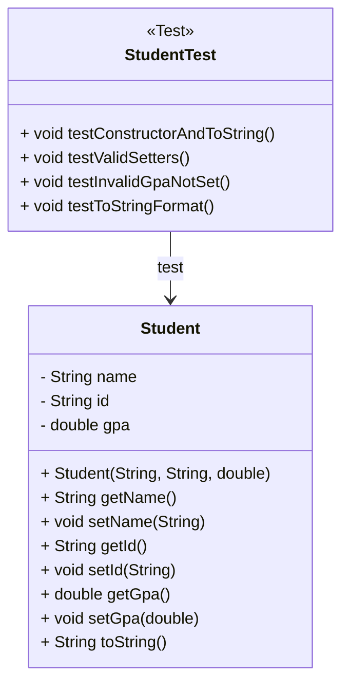

# Constructores, Getters y Setters, toString

## ¿Qué es el Encapsulamiento?

Es uno de los **pilares fundamentales de la POO** y consiste en **proteger los datos internos de una clase**, haciendo que solo puedan ser accedidos o modificados a través de métodos controlados: los **getters** y **setters**.

Esto permite:

- Validar datos antes de asignarlos.
- Evitar accesos no deseados.
- Mantener el principio de ocultamiento de la información.

## ¿Qué es un Constructor?

Un **constructor** es un método especial que **se ejecuta automáticamente al crear un objeto**.

Un constructor es un **método especial** que se llama automáticamente cuando se crea un objeto de una clase. Su objetivo es **inicializar el estado (atributos)** del objeto.

### Diferencias clave con un método normal

|Característica|Constructor|Método normal|
|--|--|--|
|Tiene nombre de la clase|Sí|No necesariamente|
|Tiene tipo de retorno|No|Sí (puede ser `void` o cualquier tipo)|
|Se invoca automáticamente|Al usar `new`|Manualmente|

### Tipos de constructores

Existen 3 tipos:

1. Constructor **implícito**: Si no defines ningún constructor, Java crea uno automáticamente **sin parámetros**.

   ```java
   public class Book {
       private String title;
       // Java genera automáticamente: public Book() {}
   }
   ```

2. Constructor **vacío**: Tú mismo defines un constructor sin parámetros. Se usa cuando quieres permitir la creación del objeto **sin establecer valores de inmediato**.

   ```java
   public class Book  {
       // puedes dejarlo vacío o incluir un mensaje
      public Book() {}
   }
   ```

3. Constructor **con parámetros**: Permite inicializar el objeto directamente con **datos personalizados**, evitando llamadas repetidas a setters.

   ```java
   public class Book {
      public Book(String title, String author) {
          this.title = title;
          this.author = author;
      }
   }
   ```

### Sobrecarga de constructores

Puedes definir **varios constructores** con diferente número o tipo de parámetros. Esto se llama **overloading**.

```java
public class Book {
    private String title;
    private String author;

    public Book() {
        this.title = "Unknown";
        this.author = "Anonymous";
    }

    public Book(String title) {
        this.title = title;
        this.author = "Anonymous";
    }

    public Book(String title, String author) {
        this.title = title;
        this.author = author;
    }
}
```

Así puedes crear libros de diferentes formas:

```java
Book a = new Book(); // Sin datos
Book b = new Book("1984"); // Solo título
Book c = new Book("1984", "Orwell"); // Título y autor
```

### Analogías

1. **Constructor como la receta inicial:** El constructor es la **receta básica** para preparar un objeto. Si no dices nada (constructor vacío), te entrega la versión por defecto. Si das parámetros, creas una versión personalizada.

2. **Constructor como el formulario de inscripción:** Cuando un estudiante se matricula en la universidad (se construye un objeto `Student`), debe llenar un formulario con su nombre, ID, y programa académico. Ese formulario es el constructor: establece sus datos desde el principio.

### Buenas prácticas con constructores

|Recomendación|Explicación|
|--|--|
|Usa `this`|Para distinguir entre atributos y parámetros con el mismo nombre|
|Aplica sobrecarga|Da flexibilidad a quienes usan la clase|
|Valida datos|Puedes validar valores en el constructor (ej. `gpa >= 0`)|
|Mantén la clase coherente|Un constructor debe dejar el objeto en un estado válido|

## ¿Qué son Getters y Setters?

Son métodos públicos que permiten **leer (get)** y **modificar (set)** los atributos privados.

- `getName()` → devuelve el valor del nombre.
- `setName("David")` → asigna un nuevo valor.

Esto permite aplicar el principio **"acceso controlado"**, útil para validaciones.

En Java, los **getters** y **setters** son **métodos públicos** que permiten acceder y modificar los atributos **privados** de una clase, siguiendo el principio de **encapsulamiento**.

### ¿Por qué usar getters y setters?

|Motivo|Beneficio|
|--|--|
|Encapsular el estado|Controla el acceso directo a los atributos|
|Validar antes de asignar|Permite comprobar o transformar datos antes de guardarlos|
|Ocultar implementación|Puedes cambiar cómo funciona internamente sin afectar al exterior|
|Reforzar mantenibilidad|Facilita el mantenimiento y crecimiento del sistema|

### Estructura general

La convención en Java es que los métodos `getX()` y `setX()` usen el mismo nombre del atributo, con la primera letra en mayúscula.

```java
private String name;

public String getName() {
    return name;
}

public void setName(String name) {
    this.name = name;
}
```

### Buenas Prácticas con Getters y Setters

|Práctica|Explicación|
|--|--|
|Validar datos en `setX()`|Evita estados incorrectos del objeto|
|No uses `getX()` innecesarios|Solo para atributos relevantes al exterior|
|`getX()` nunca modifica|Nunca debe alterar el estado, solo devolver información|
|Usa `boolean isActive()`|Para atributos booleanos, usar `isX()` en vez de `getX()`|
|Anótalos con `@Override` si corresponde|Si estás sobrescribiendo un método existente|

## ¿Qué es el método `toString()`?

Es un método especial **heredado de la clase** `Object` que sirve para devolver una **representación en texto** de un objeto. Por defecto, devuelve algo como:

```txt
Student@3e25a5
```

Esto es poco útil. Por eso, es una práctica común sobrescribirlo (`@Override`) para mostrar información legible y significativa del objeto.

```java
//highlight-next-line
@Override // Se usa el decorador para sobrescribir el método
public String toString() {
    return name + " (" + id + ")";
}
```

### ¿Por qué es importante sobrescribir `toString()`?

|Beneficio|Descripción|
|--|--|
|Facilita depuración|Ver claramente los valores internos al imprimir el objeto|
|Mejora trazabilidad|Permite entender qué contiene una colección de objetos (como `ArrayList`)|
|Útil para logs o exportación|Proporciona salida legible para archivos, reportes o visualización en GUI|

### Buenas Prácticas con `toString()`

|Práctica|Explicación|
|--|--|
|Sobrescribir siempre|Para evitar la salida genérica de `Object`|
|Mostrar solo lo necesario|Evita imprimir datos sensibles (contraseñas, tokens…)|
|Usar `@Override`|Para dejar claro que estás reemplazando el método heredado|
|Úsalo en métodos `System.out.println()`|...y en logs o visualizaciones automáticas de objetos|
|Usa un formato uniforme |Para facilitar la lectura e integración con otras herramientas|

## Código en Java

import Tabs from "@theme/Tabs";
import TabItem from "@theme/TabItem";

<Tabs>
<TabItem value="diagrama" label="Diagrama de Clases">



</TabItem>
<TabItem value="java1" label="Clase Student">

```java
import java.util.ArrayList;

/**
 * Represents a student with basic academic information.
 */
public class Student {
    private String name;
    private String id;
    private double gpa;

    /**
     * Default constructor.
     */
    public Student() {}

    /**
     * Constructs a student with all required fields.
     * @param name Full name of the student.
     * @param id Student ID code.
     * @param gpa Grade point average (0.0 - 5.0).
     */
    public Student(String name, String id, double gpa) {
        this.name = name;
        this.id = id;
        this.gpa = gpa;
    }

    /** Returns the student name. */
    public String getName() { return name; }

    /** Sets the student name. */
    public void setName(String name) {
        if (name != null && !name.isBlank()) {
            this.name = name;
        }
    }

    /** Returns the student ID. */
    public String getId() { return id; }

    /** Sets the student ID. */
    public void setId(String id) { this.id = id; }

    /** Returns the student's GPA. */
    public double getGpa() { return gpa; }

    /** Sets the GPA, ensuring it's within valid range. */
    public void setGpa(double gpa) {
        if (gpa >= 0.0 && gpa <= 5.0) {
            this.gpa = gpa;
        }
    }

    /** Returns a text representation of the student. */
    @Override
    public String toString() {
        return "Student{name='" + name + "', id='" + id + "', gpa=" + gpa + "}";
    }
}
```

</TabItem>
<TabItem value="java2" label="Test Unitarios">

```java
import org.junit.jupiter.api.Test;
import static org.junit.jupiter.api.Assertions.*;

public class StudentTest {

    @Test
    void testConstructorAndToString() {
        Student s = new Student("Carlos", "U123", 4.5);
        assertEquals("Carlos", s.getName());
        assertEquals("U123", s.getId());
        assertEquals(4.5, s.getGpa());
        assertTrue(s.toString().contains("Carlos"));
    }

    @Test
    void testValidSetters() {
        Student s = new Student();
        s.setName("Lucía");
        s.setGpa(4.7);
        assertEquals("Lucía", s.getName());
        assertEquals(4.7, s.getGpa());
    }

    @Test
    void testInvalidGpaNotSet() {
        Student s = new Student();
        s.setGpa(6.0); // Invalid
        assertEquals(0.0, s.getGpa()); // default remains
    }

    @Test
    void testToStringFormat() {
        Student s = new Student("Ana", "S001", 4.2);
        String expected = "Student{name='Ana', id='S001', gpa=4.2}";
        assertEquals(expected, s.toString());
    }
}
```

</TabItem>
</Tabs>

## Mini Proyecto

### Descripción

Desarrolla un pequeño sistema en consola que permita:

- Crear objetos de tipo `Product`.
- Usar un constructor con parámetros.
- Utilizar getters y setters para acceder y modificar sus atributos.
- Imprimir la información de los productos usando `toString()`.
- Almacenar varios productos en un `ArrayList`.

### Requisitos funcionales

1. Crear una clase `Product` con los siguientes atributos:
   - String name
   - String code
   - double price
   - int quantity
2. Implementar:
   - Un constructor vacío y uno con todos los parámetros.
   - Getters y Setters para cada atributo.
   - Método sobrescrito toString() para mostrar la información del producto.
3. En el método main:
   - Crear al menos 5 productos y almacenarlos en una lista.
   - Modificar al menos un producto con setters.
   - Imprimir la información de todos los productos con un bucle usando toString().

## Reflexión final

Principios SOLID aplicados a los constructores:

- **S (Single Responsibility)**: Cada constructor tiene una única función: inicializar el objeto correctamente.
- **O (Open/Closed)**: Puedes agregar nuevos constructores sin modificar los anteriores.
- **L (Liskov Substitution)**: En clases hijas, puedes invocar `super()` para llamar al constructor de la superclase.

Principios SOLID aplicados a los getters y setters:

- **S (Single Responsibility)**: Acceso y modificación controlada del estado del objeto
- **O (Open/Closed)**: Se pueden agregar nuevas validaciones sin afectar usuarios externos
- **L (Liskov Substitution)**: Clases hijas pueden sobrescribir getters/setters sin romper compatibilidad

Principios SOLID aplicados al `toString()`:

- **S (Single Responsibility)**: `toString()` solo debe mostrar el estado del objeto como texto
- **O (Open/Closed)**: Puedes extender la clase y redefinir `toString()` según el nuevo contexto
- **L (Liskov Substitution)**: Cualquier subclase puede usar su propia versión de `toString()`

## Recursos y Bibliografía

- Oracle. (2024). [Java Constructors](https://docs.oracle.com/javase/tutorial/java/javaOO/constructors.html)
- Oracle. (2024). [Encapsulation and Accessor Methods](https://docs.oracle.com/javase/tutorial/java/javaOO/accesscontrol.html)
- Oracle. (2024). [toString() Method Documentation](https://docs.oracle.com/javase/8/docs/api/java/lang/Object.html#toString--)
- Horstmann, C. S. (2020). Core Java Volume I – Fundamentals. Pearson.
- Baeldung. (2023). [Guide to Constructors in Java](https://www.baeldung.com/java-constructors)
- Baeldung. (2023). [Guide to Java toString()](https://www.baeldung.com/java-tostring)
