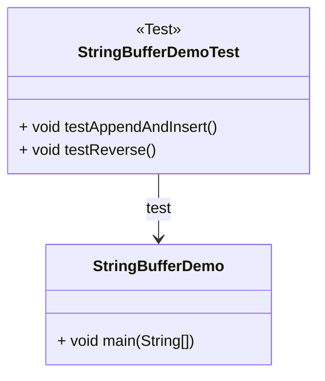
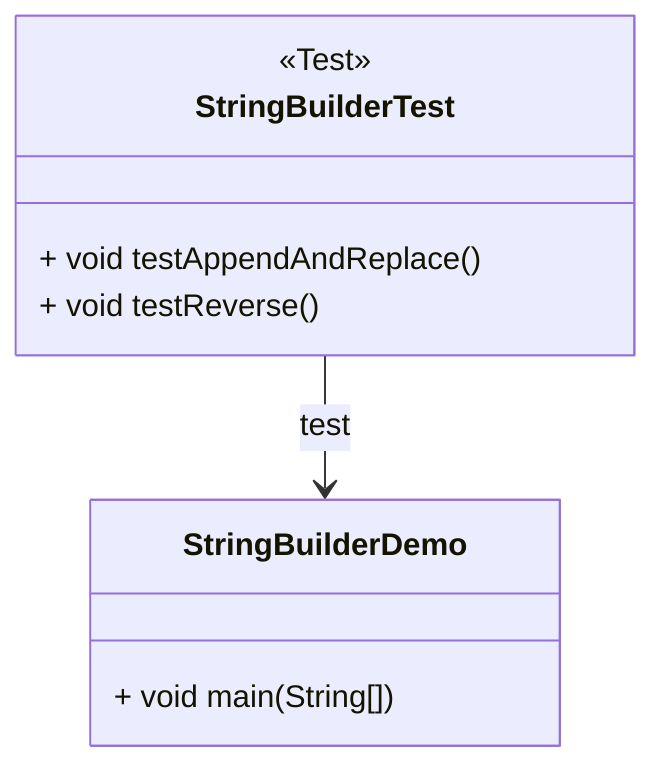
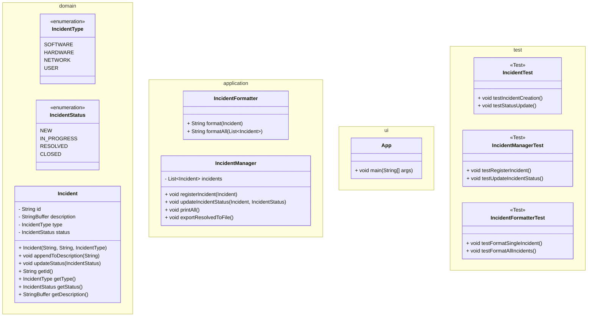
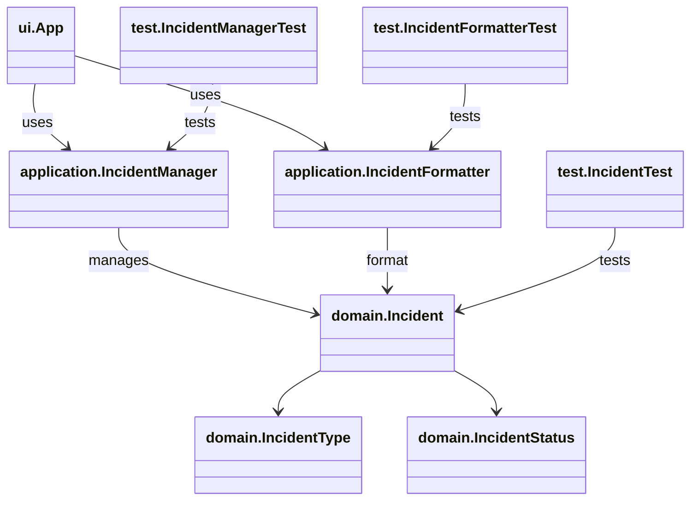

# Enums, String, StringBuffer y StringBuilder

## ¿Qué es un enum?

Un `enum` (abreviatura de *enumeration*) es un **tipo especial de clase** en Java que representa un **conjunto fijo de constantes con nombre**. Es ideal para modelar estados, categorías, roles o valores finitos e inmutables.

Por ejemplo: `ACTIVE`, `INACTIVE`, `SUSPENDED` son posibles estados de un usuario.

Ventajas:

- Legibilidad del código.
- Seguridad de tipo (no se permiten valores inválidos).
- Fácil de mantener y extender.

```java title="UserStatus.java" showLineNumbers
public enum UserStatus {
    ACTIVE,
    INACTIVE,
    SUSPENDED,
    DELETED
}

UserStatus status = UserStatus.ACTIVE;
```

### ¿Por qué usar `enum` en vez de String o enteros?

|Alternativa|Problemas comunes|
|--|--|
|Cadenas (`String`)|Errores de tipeo, valores inválidos, difícil mantenimiento|
|Números (`int`)|Poco expresivos, sin validación, no indican claramente el valor|
|`enum`|Seguro, legible, validado en tiempo de compilación|

### Características de los `enum` en Java

1. **Son clases especiales:** Puedes agregar atributos, constructores, métodos.
2. **Tienen métodos útiles por defecto**:

   ```java showLineNumbers
   UserStatus.ACTIVE.name();      // "ACTIVE"
   UserStatus.ACTIVE.ordinal();   // 0 (posición)
   UserStatus.valueOf("SUSPENDED"); // UserStatus.SUSPENDED
   ```

### Ejemplo con atributos y métodos

Definición de un `enum` con atributos y métodos:

```java title="Priority.java" showLineNumbers
public enum Priority {
    HIGH("🔴 Urgente"),
    MEDIUM("🟡 Normal"),
    LOW("🟢 Baja");

    private final String label;

    Priority(String label) {
        this.label = label;
    }

    public String getLabel() {
        return label;
    }
}
```

Forma de uso:

```java
Priority priority = Priority.HIGH;
System.out.println(priority.getLabel()); // "🔴 Urgente"
```

Llevemos el ejemplo un poco más allá usando un switch-case:

```java showLineNumbers
public String getMessageForStatus(UserStatus status) {
    switch (status) {
        case ACTIVE: return "Welcome!";
        case SUSPENDED: return "Your account is suspended.";
        case DELETED: return "User no longer exists.";
        default: return "Unknown status.";
    }
}
```

### Buenas prácticas para los enums en Java

|Recomendación|Ejemplo o razón|
|--|--|
|Usar nombres en **MAYÚSCULAS**|`PENDING`, `APPROVED`, `REJECTED`|
|Evitar asociar valores mágicos|Usar `enum` en lugar de `int` con significado oculto|
|Añadir métodos cuando sea útil|`getLabel()`, `getColorCode()`|
|Usar `switch` para lógica contextual|Mensajes por estado, iconos, acciones|
|No usar `enum` para datos que cambian |Ej. categorías de producto si son configurables|

## ¿Qué es `String` en Java?

`String` es una clase **inmutable**: cada vez que modificas una cadena, se crea una nueva instancia. Es útil para textos **estáticos** o de **baja modificación**.

```java
String s = "Hello";
//highlight-next-line
s = s + " World"; // Crea un nuevo objeto internamente
```

En Java, `String` es una **clase** (no un tipo primitivo) que representa una **secuencia de caracteres Unicode**. Es ampliamente usada para manejar **textos**, nombres, mensajes, rutas, comandos, entre otros.

### ¿Por qué es importante?

- Todas las interacciones con el usuario y el sistema usan texto: nombres, contraseñas, correos, estados, etc.
- Muchos errores en software ocurren por manipulación incorrecta de texto (ej. concatenación o validación).

### Características clave

|Característica|Explicación|
|--|--|
|**Inmutable**|Una vez creado, su valor no puede cambiar. Toda modificación crea un nuevo objeto.|
|**Optimizado internamente**|Usa un **String pool** para evitar duplicados y ahorrar memoria.|
|**Soporta Unicode**|Compatible con múltiples idiomas y emojis.|
|**Extremadamente usado**|Está presente en la mayoría de clases estándar, bases de datos, APIs, etc.|

### ¿Por qué es inmutable?

Internamente, un `String` es **final**, y sus datos están protegidos. Esta inmutabilidad permite:

- Seguridad en estructuras concurrentes.
- Uso seguro como clave en `HashMap`.
- Eficiencia en el *string pool* (evita crear múltiples copias).

### Métodos comunes de la clase `String`

|Método|Ejemplo de uso|Resultado|
|--|--|--|
|`length()`|`"Hola".length()`|`4`|
|`charAt(i)`|`"Hola".charAt(1)`|`'o'`|
|`toUpperCase()`|`"hola".toUpperCase()`|`"HOLA"`|
|`trim()`|`" hola ".trim()`|`"hola"`|
|`equals("texto")`|`"Java".equals("java")`|`false`|
|`equalsIgnoreCase()`|`"Java".equalsIgnoreCase("java")`|`true`   |
|`substring(1, 3)`|`"Hola".substring(1,3)`|`"ol"`|
|`split(" ")`|`"uno dos tres".split(" ")`|`["uno", "dos", "tres"]`|
|`contains("la")`|`"Hola".contains("la")`|`true`|

### Errores comunes al usar `String`

|Error|Mejor práctica|
|--|--|
|Comparar con `==`|Usar `.equals()`|
|Concatenar en bucles grandes|Usar `StringBuffer` o `StringBuilder`|
|Olvidar `trim()` en input|Siempre limpiar entrada del usuario|
|Concatenar muchos `+` encadenados|Usar `.concat()` o builder|

### Mini ejemplo

```java  title="StringExample.java" showLineNumbers
public class StringExample {
    public static void main(String[] args) {
        String fullName = " Ana María ";
        System.out.println("Original: '" + fullName + "'");
        fullName = fullName.trim().toUpperCase();
        System.out.println("Limpio: '" + fullName + "'");
    }
}

// Original: ' Ana María '
// Limpio: 'ANA MARÍA'
```

## ¿Qué es `StringBuffer`?

`StringBuffer` es una clase **mutable y sincronizada**, ideal para **modificaciones frecuentes de texto**, como concatenaciones en bucles. Cómo características principales podemos mencionar:

- **Mutable:** Puedes cambiar su contenido sin crear nuevos objetos.
- **Thread-safe:** Está sincronizado internamente: es seguro para múltiples hilos.
- **Más lento que `StringBuilder`:** Por su sincronización interna.
- **Pertenece al paquete:** `java.lang.StringBuffer`

### ¿Por qué no usar String para todo?

Recordemos que `String` es `inmutable`. Cada vez que haces una operación como:

```java
String mensaje = "Hola";
mensaje += " mundo";
```

Internamente, Java crea un **nuevo objeto** con cada concatenación, lo cual consume más memoria y tiempo.

Con `StringBuffer`, puedes hacer esto de forma **eficiente**:

```java
StringBuffer sb = new StringBuffer("Hola");
sb.append(" mundo"); // Se modifica el mismo objeto
```

> `String` es como escribir en una hoja que luego tiras para escribir otra.
>
> `StringBuffer` es un cuaderno donde puedes **borrar, añadir o reescribir** sin desechar la hoja.

### Métodos más comunes de `StringBuffer`

|Método|Ejemplo|Resultado|
|--|--|--|
|`append(String)`|`sb.append(" Mundo")`|Añade al final|
|`insert(int, String)`|`sb.insert(5, "Java")`|Inserta en posición específica|
|`replace(i, j, s)`|`sb.replace(0, 4, "Hola")`|Reemplaza parte de la cadena|
|`delete(i, j)`|`sb.delete(0, 2)`|Elimina parte del texto|
|`reverse()`|`sb.reverse()`|Invierte el texto|
|`toString()`|`sb.toString()`|Devuelve el contenido como `String`|

## Ejemplo de uso de `StringBuffer`

import Tabs from "@theme/Tabs";
import TabItem from "@theme/TabItem";

<Tabs>
<TabItem value="diagram" label="Diagrama de clases">



</TabItem>
<TabItem value="java" label="Ejemplo de uso">

```java title="StringBufferDemo.java" showLineNumbers
public class StringBufferDemo {
    public static void main(String[] args) {
        StringBuffer sb = new StringBuffer("Hola");
        sb.append(" mundo");              // "Hola mundo"
        sb.insert(5, "Java ");            // "Hola Java mundo"
        sb.replace(0, 4, "Hey");          // "Hey Java mundo"
        sb.delete(4, 9);                  // "Hey mundo"
        sb.reverse();                     // "odnum yeH"
        System.out.println(sb.toString());
    }
}
```

**Salida:** `odnum yeH`

</TabItem>
<TabItem value="test" label="Test Unitario">

```java title="StringBufferDemoTest.java" showLineNumbers
import org.junit.jupiter.api.Test;
import static org.junit.jupiter.api.Assertions.*;

public class StringBufferDemoTest {

    @Test
    void testAppendAndInsert() {
        StringBuffer sb = new StringBuffer("Hola");
        sb.append(" mundo");
        sb.insert(5, "Java ");
        assertEquals("Hola Java mundo", sb.toString());
    }

    @Test
    void testReverse() {
        StringBuffer sb = new StringBuffer("Colombia");
        sb.reverse();
        assertEquals("aibmoloC", sb.toString());
    }
}
```

</TabItem>
</Tabs>

### En que proyectos usar StringBuffer

|Caso de uso|¿Por qué usar `StringBuffer`?|
|--|--|
|Editores de texto|Modificaciones dinámicas de cadenas|
|Generación de reportes|Concatenación de grandes volúmenes de texto|
|Logs sincronizados|Varios hilos escribiendo en buffer compartido|
|Procesamiento de comandos|Construcción de mensajes complejos dinámicamente|

## ¿Ques es `StringBuilder`?

`StringBuilder` es una clase de Java que permite **crear y modificar cadenas de texto de forma eficiente y mutable**. A diferencia de `String` (inmutable), `StringBuilder` permite **modificar la misma instancia** sin generar nuevos objetos cada vez que se cambia el contenido.

> Fue introducida en Java 5 como una **versión no sincronizada** de `StringBuffer`, pensada para **uso en un solo hilo** (no thread-safe).

### ¿Por qué usar StringBuilder?

|Situación|¿Usar `StringBuilder`?|
|--|--|
|Concatenar texto dentro de bucles grandes|Sí|
|Generar contenido dinámico rápidamente|Sí|
|Operaciones de texto en interfaz gráfica|Sí|
|Aplicaciones multihilo|No. Mejor usar `StringBuffer`|
|Texto fijo o de solo lectura|No. Mejor Usar `String`|

### Características clave de `StringBuilder`

|Característica|Valor|
|--|--|
|Mutable|Si|
|Sincronizado|No, pero es más rápido que `StringBuffer`|
|Velocidad|Alta|
|Pertenece a|`java.lang`|
|Hereda de|`AbstractStringBuilder`|
|Compatible con|`CharSequence`|

### Métodos más comunes

|Método|Ejemplo|Resultado|
|--|--|--|
|`append(String)`|`sb.append("Hola")`|Agrega texto al final|
|`insert(int, String)`|`sb.insert(5, "Mundo")`|Inserta texto en posición|
|`replace(i, j, String)`|`sb.replace(0, 4, "Hola")`|Reemplaza parte del texto|
|`delete(i, j)`|`sb.delete(0, 3)`|Elimina parte del contenido|
|`reverse()`|`sb.reverse()`|Invierte el texto|
|`toString()`|`sb.toString()`|Convierte a `String`|
|`length()`|`sb.length()`|Devuelve el número de caracteres|
|`capacity()`|`sb.capacity()`|Capacidad del buffer interno|

### Ejemplo de uso de `StringBuilder`

<Tabs>
<TabItem value="diagram" label="Diagrama de clases">



</TabItem>
<TabItem value="java1" label="Clase Demo">

```java title="StringBuilderDemo.java" showLineNumbers
public class StringBuilderDemo {
    public static void main(String[] args) {
        StringBuilder sb = new StringBuilder("Hola");
        sb.append(" mundo");
        sb.insert(5, "Java ");
        sb.replace(0, 4, "Hey");
        sb.delete(4, 9);
        sb.reverse();
        System.out.println(sb.toString());
    }
}
```

**Salida:** `odnum yeH`

</TabItem>
<TabItem value="java2" label="Test Unitarios">

```java title="StringBuilderDemo.java" showLineNumbers
import org.junit.jupiter.api.Test;
import static org.junit.jupiter.api.Assertions.*;

public class StringBuilderTest {

    @Test
    void testAppendAndReplace() {
        StringBuilder sb = new StringBuilder("Bienvenido");
        sb.append(" estudiante");
        sb.replace(0, 9, "Hola");
        assertEquals("Hola estudiante", sb.toString());
    }

    @Test
    void testReverse() {
        StringBuilder sb = new StringBuilder("Java");
        sb.reverse();
        assertEquals("avaJ", sb.toString());
    }
}
```

</TabItem>
</Tabs>

## Comparativa

### ... de conceptos

|Clase|Inmutable|Hilo seguro|Rápida en 1 hilo|Recomendado para…|
|--|--|--|--|--|
|`String`|✅|✅|No aplica|Texto estático, solo lectura|
|`StringBuffer`|❌|✅|Lento|Concatenación multihilo segura|
|`StringBuilder`|❌|❌|Rápido|Concatenaciones en apps locales|

### ... de Rendimiento (String, StringBuffer, StringBuilder)

```java title="StringConcatBenchmark.java" showLineNumbers
public class StringConcatBenchmark {
    public static void main(String[] args) {
        final int ITERATIONS = 100_000;

        // String (inmutable)
        long start1 = System.nanoTime();
        String text = "";
        for (int i = 0; i < ITERATIONS; i++) {
            text += "a";
        }
        long end1 = System.nanoTime();
        System.out.println("String: " + ((end1 - start1) / 1_000_000) + " ms");

        // StringBuffer (mutable + sincronizado)
        long start2 = System.nanoTime();
        StringBuffer buffer = new StringBuffer();
        for (int i = 0; i < ITERATIONS; i++) {
            buffer.append("a");
        }
        long end2 = System.nanoTime();
        System.out.println("StringBuffer: " + ((end2 - start2) / 1_000_000) + " ms");

        // StringBuilder (mutable + no sincronizado)
        long start3 = System.nanoTime();
        StringBuilder builder = new StringBuilder();
        for (int i = 0; i < ITERATIONS; i++) {
            builder.append("a");
        }
        long end3 = System.nanoTime();
        System.out.println("StringBuilder: " + ((end3 - start3) / 1_000_000) + " ms");
    }
}
```

Los resultados que podemos esperar son:

|Tipo|Tiempo esperado (100,000 repeticiones)|
|--|--|
|`String`|Muy lento (cientos de ms o más)|
|`StringBuffer`|Mejor (30-100 ms)|
|`StringBuilder`|Mejor rendimiento (10-50 ms)|

## Mini-Proyecto: Gestor de Registro de Incidentes

### Enunciado

Un sistema institucional necesita registrar, clasificar y mostrar **incidentes reportados por los usuarios**. Cada incidente debe tener:

- Una descripción escrita (editable).
- Un tipo definido (`SOFTWARE`, `HARDWARE`, `NETWORK`, `USER`).
- Un estado (`NEW`, `IN_PROGRESS`, `RESOLVED`, `CLOSED`).
- Una salida final formateada con StringBuffer.

La estructura básica e ideal del proyecto sería:

- enum IncidentType
- enum IncidentStatus
- class Incident
- class IncidentFormatter
- class IncidentManager

### Requisitos

1. Crear los enums `IncidentType` y `IncidentStatus` con valores descriptivos.
2. Crear clase `Incident` que contenga:
   - id (String)
   - description (StringBuffer)
   - type (`IncidentType`)
   - status (`IncidentStatus`)
3. Implementar métodos para:
   - Modificar descripción con `StringBuffer` (append, replace, delete).
   - Cambiar el estado del incidente.
   - Mostrar un resumen formateado del incidente con `toString()` usando `StringBuffer`.
4. Registrar al menos **5 incidentes simulados**.
5. Mostrar todos los incidentes ordenados por estado o tipo.

### Ejemplo de salida esperada

```txt
[INC0003] NETWORK - NEW
Descripción: Usuario no puede conectarse a WiFi institucional.
---------------------------------------------------------------
[INC0004] HARDWARE - RESOLVED
Descripción: Cambio de teclado en Sala de Sistemas 5.
---------------------------------------------------------------
```

### Pistas

<Tabs>
<TabItem value="diagrama" label="Diagrama de clases">

#### Distribución de clases por paquetes



#### Relaciones entre clases



</TabItem>
<TabItem value="java1" label="Enums">

```java title="IncidentType.java" showLineNumbers
public enum IncidentType {
    SOFTWARE, HARDWARE, NETWORK, USER
}
```

```java title="IncidentStatus.java" showLineNumbers
public enum IncidentStatus {
    NEW, IN_PROGRESS, RESOLVED, CLOSED
}
```

</TabItem>
<TabItem value="java2" label="POJOs">

```java title="Incident.java" showLineNumbers
/**
 * POJO class to represent an Incident.
 */
public class Incident {
    private String id;
    private StringBuffer description;
    private IncidentType type;
    private IncidentStatus status;

    public Incident(String id, String description, IncidentType type) {
        this.id = id;
        this.description = new StringBuffer(description);
        this.type = type;
        this.status = IncidentStatus.NUEVO;
    }

    /**
     * Append a message to the description
     * 
     * @param text the text to append to description
     */
    public void appendToDescription(String text) {
        description.append(" ").append(text);
    }

    /**
     * Update the status of the incident
     * 
     * @param newStatus the new status
     */
    public void updateStatus(IncidentStatus newStatus) {
        this.status = newStatus;
    }

    // Here: Only Getters
}
```

```java title="IncidentFormatter.java" showLineNumbers
/**
 * Utility class to format Incident objects for display.
 */
public class IncidentFormatter {
    /**
     * Formats a single incident as a structured string.
     * @param incident The incident to format.
     * @return A string representation using StringBuffer.
     */
    public String format(Incident incident) {
        StringBuffer sb = new StringBuffer();
        sb.append("[").append(incident.getId()).append("] ");
        sb.append(incident.getType()).append(" - ").append(incident.getStatus()).append("\n");
        sb.append("Descripción: ").append(incident.getDescription().toString()).append("\n");
        sb.append("-".repeat(60)).append("\n");
        return sb.toString();
    }

    /**
     * Formats a list of incidents.
     * @param incidents A list of incidents.
     * @return A string with all formatted incidents.
     */
    public String formatAll(List<Incident> incidents) {
        StringBuffer sb = new StringBuffer();
        for (Incident i : incidents) {
            sb.append(format(i));
        }
        return sb.toString();
    }
}
```

</TabItem>
</Tabs>

## Reflexión final

Aplicación de principios SOLID:

- **S - Single Responsibility:** Cada `enum` representa **una sola responsabilidad** clara. `StringBuffer` solo se encarga de manipular texto mutable.
- **O - Open/Close:** Puedes **agregar nuevos comportamientos** sin alterar clases existentes. Puedes extender `StringBuffer` creando funciones auxiliares sin modificar si código.
- **L - Liskov Substitution:**: Puedes **usar cualquier valor del enum sin romper lógica existente.** Métodos que esperan `CharSequence` pueden aceptar `CharSequence` pueden aceptar `String`, `StringBuilder` o `StringBuffer`.

## Aplicaciones prácticas en proyectos reales

|Caso de uso|¿Por qué usar `StringBuffer`?|
|--|--|
|Editores de texto|Modificaciones dinámicas de cadenas|
|Generación de reportes|Concatenación de grandes volúmenes de texto|
|Logs sincronizados|Varios hilos escribiendo en buffer compartido|
|Procesamiento de comandos|Construcción de mensajes complejos dinámicamente|

## Recursos y Biografía

- Oracle. (2024). [Enum Types (Java Tutorials)](https://docs.oracle.com/javase/tutorial/java/javaOO/enum.html)
- Oracle. (2024). [Java String Class Documentation](https://docs.oracle.com/en/java/javase/21/docs/api/java.base/java/lang/String.html)
- Oracle. (2024). [StringBuilder API Docs](https://docs.oracle.com/en/java/javase/21/docs/api/java.base/java/lang/StringBuilder.html)
- Baeldung. (2023). [Guide to Java String](https://www.baeldung.com/java-string)
- Horstmann, C. S. (2020). Core Java Volume I. Pearson.
