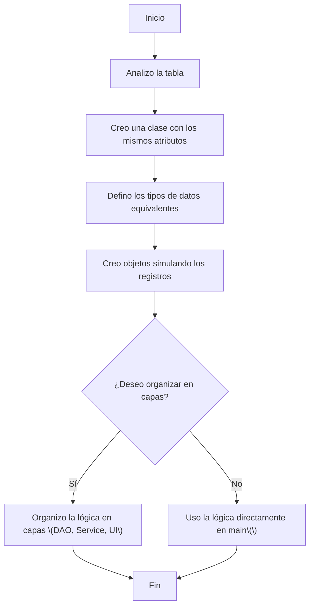
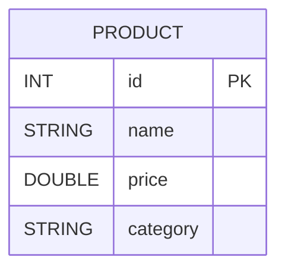
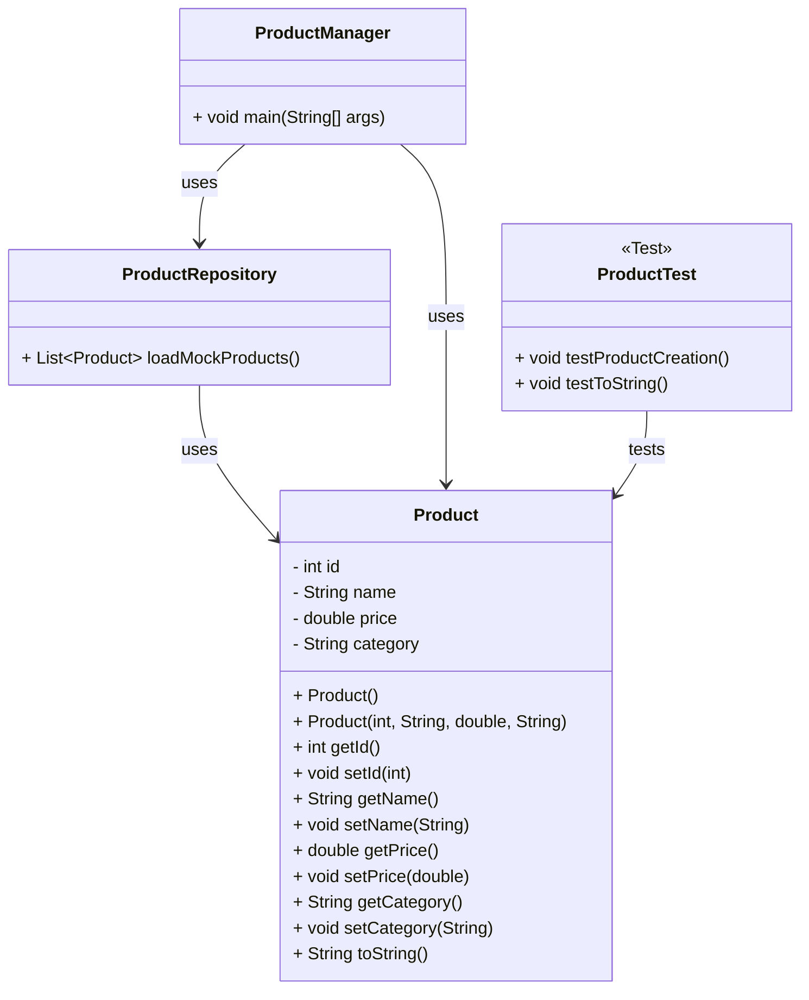

# Mapeo y Creación de Objetos

En programación orientada a objetos, una práctica común es **mapear una tabla de base de datos a una clase Java**. Este proceso se conoce como **mapeo objeto-relacional (ORM básico - basic Object-Relation Mapping)**, y permite representar registros como objetos y columnas como atributos.

Por ejemplo:

Tabla `products` → Clase `Product`
Columna `price` → atributo `private double price`

Este concepto es la base de herramientas como **Hibernate**, pero aquí lo abordamos manualmente para entender los fundamentos.

## ¿Por qué es importante?

- Separa la lógica de negocio de la persistencia de datos
- Facilita la lectura y mantenimiento del código
- Es la base de herramientas profesionales como Hibernate, JPA y Spring Data
- Permite simular acceso a datos en proyectos sin usar aún una base de datos real

## Relación tabla - clase

|Elemento de la base de datos|Elemento en Java|
|--|--|
|Fila (registro)|Objeto|
|Columna|Atributo de clase|
|Tabla|Clase POJO|
|Relaciones|Atributos tipo objeto o lista|

## Tipos de mapeo comunes

1. **Mapeo simple** (una tabla ↔ una clase)
2. **Relaciones uno a muchos** (ej. Cliente → muchos pedidos)}
3. **Relaciones muchos a muchos** (ej. Cursos ↔ Estudiantes con intermedia `Enrollment`)
4. Mapeo con enum (ej. status como `ACTIVE`, `DROPPED`)

## Mapeo manual vs automático

|Mapeo manual (POJO)             |Mapeo automático (ORM)           |
|------------------------------- |-------------------------------- |
|Código escrito a mano           |Herramientas como Hibernate      |
|Ideal para aprender y practicar |Ideal para proyectos grandes     |
|Control total del diseño        |Automatiza validación, inserción |

## Buenas prácticas al mapear manualmente

- Usa encapsulamiento (`private` + getters/setters)
- Implementa `toString()` para visualizar objetos
- Utiliza **constructores sobrecargados**
- Representa relaciones entre clases con objetos u listas
- Aplica enum cuando una columna tiene valores fijos

## Flujo de mapeo manual



## Ejemplo de código Java

Imagina que tienes una base de datos con la siguiente tabla:



El siguiente paso sería bosquejar nuestro proyecto para que pueda trabajar correctamente con la base de datos, y adicionar servicios y funciones que nos pide el cliente:



Creado el diagrama de clases, podemos pasar a mapear el producto en una clase, también lo podemos llamar entidad o modelo.

```java title="Product.java" showLineNumbers
/**
 * Represents a product in an inventory system.
 */
public class Product {
    private int id;
    private String name;
    private double price;
    private String category;

    /** Empty constructor */
    public Product() {}

    /** Full constructor */
    public Product(int id, String name, double price, String category) {
        this.id = id;
        this.name = name;
        this.price = price;
        this.category = category;
    }

    // Getters and setters
    public int getId() { return id; }
    public void setId(int id) { this.id = id; }

    public String getName() { return name; }
    public void setName(String name) { this.name = name; }

    public double getPrice() { return price; }
    public void setPrice(double price) { this.price = price; }

    public String getCategory() { return category; }
    public void setCategory(String category) { this.category = category; }

    @Override
    public String toString() {
        return "Product [id=" + id + ", name=" + name +
               ", price=" + price + ", category=" + category + "]";
    }
}
```

Otro paso es simular un repositorio de datos, para esto podemos crear un arreglo con productos ficticios que luego podemos cargar.

```java title="ProductRepository.java" showLineNumbers
import java.util.ArrayList;
import java.util.List;

/**
 * Simulates a data source for products.
 */
public class ProductRepository {

    public List<Product> loadMockProducts() {
        List<Product> products = new ArrayList<>();
        products.add(new Product(1, "Laptop", 4200.0, "Electronics"));
        products.add(new Product(2, "Notebook", 8.5, "Stationery"));
        products.add(new Product(3, "Coffee", 12.0, "Food"));
        return products;
    }
}
```

Por último comprobamos a traves de los test que nuestro código funciona correctamente.

```java title="ProductTest.java" showLineNumbers
import org.junit.jupiter.api.Test;
import static org.junit.jupiter.api.Assertions.*;

public class ProductTest {
    @Test
    void testProductCreation() {
        Product p = new Product(1, "Mouse", 25.0, "Electronics");
        assertEquals("Mouse", p.getName());
        assertEquals(25.0, p.getPrice());
    }

    @Test
    void testToString() {
        Product p = new Product(2, "Pen", 1.5, "Stationery");
        String output = p.toString();
        assertTrue(output.contains("Pen"));
        assertTrue(output.contains("Stationery"));
    }
}
```

## Creación de Objetos

En Java, **un objeto** es una instancia concreta de una clase.

> Una **clase** es como un plano o molde (ej. una receta), mientras que un **objeto** es la cosa real que puedes usar (ej. el pastel).

Cuando defines una clase como `Product`, **no estás creando** un estudiante aún; solo describes cómo será. Cuando haces `Product p = new Product()`, **ahí nace el objeto**, con memoria real, valores y comportamiento propios. Esto implica:

1. Se reserva memoria para el nuevo objeto.
2. Se llama al constructor que inicializa los atributos.
3. Se asigna la referencia del objeto a la variable `p`.

## Reflexión final

- Se aplicó el principio *SRP (Single Responsibility)*: `Product` solo modela datos, `ProductRepository` simula la carga, `ProductManager` maneja la lógica de impresión.
- No se aplicó DAO completamente aún, **pero ya se separan las responsabilidades**, lo que prepara el terreno para el patrón DAO completo.

## Aplicación práctica

Este enfoque de mapeo es útil para:

- Sistemas de inventario (tiendas, almacenes, bibliotecas)
- CRM (clientes como objetos)
- Plataformas educativas (materias, cursos, estudiantes)
- Videojuegos (ítems como objetos)

## Referencias

- Oracle. (2023). [Java Classes & Objects](https://docs.oracle.com/javase/tutorial/java/javaOO/classes.html)
- Horstmann, C. (2020). Core Java Volume I (11th ed.). Pearson.
- Baeldung. (2023). [Java Data Transfer Objects](https://www.baeldung.com/java-dto-pattern)
