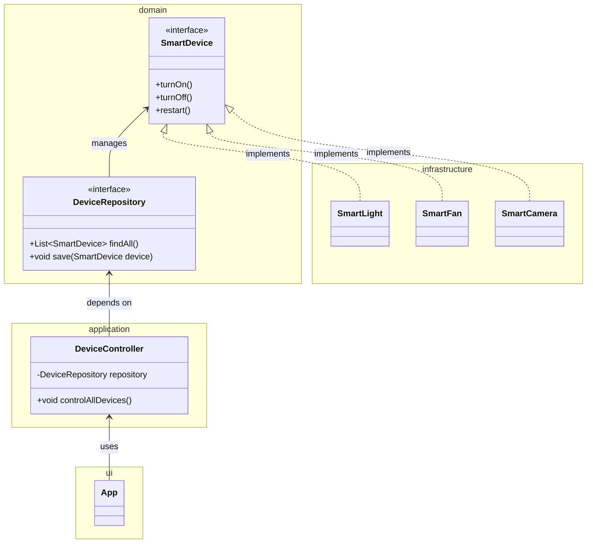

# Interfaces

## ¿Qué es una interfaz en Java?

Una **interfaz** en Java es un **contrato** que define un conjunto de métodos sin implementar. Las clases que implementan una interfaz **se comprometen a definir el comportamiento** de esos métodos.

> Una interfaz es como un “manual de instrucciones” que dice qué debe hacer una clase, pero no cómo.

## Características claves

1. Solo contiene **métodos abstractos** o métodos con implementación *default*.
2. No puede tener atributos de instancia (solo constantes).
3. Se usa con `implements`, no con `extends`.
4. Una clase puede **implementar múltiples interfaces** (herencia múltiple por interfaz).

## ¿Para qué sirven?

1. Separar la **lógica de alto nivel** de los detalles concretos.
2. Hacer que el código sea modular, reutilizable y testeable.
3. Facilitar la inyección de dependencias y los patrones de diseño (DAO, Strategy, Observer, etc.).

## Ejemplo en Java

import Tabs from "@theme/Tabs";
import TabItem from "@theme/TabItem";

<Tabs>
<TabItem value="java1" label="Ejemplo básico">

```java
/**
 * Defines basic operations for any machine.
 */
public interface Operable {
    void start();
    void stop();
    void restart();
}
```

```java
/**
 * A simple machine that implements Operable behavior.
 */
// highlight-next-line
public class Machine implements Operable {
    @Override
    public void start() {
        System.out.println("Machine starting...");
    }

    @Override
    public void stop() {
        System.out.println("Machine stopping...");
    }

    @Override
    public void restart() {
        stop();
        start();
    }
}
```

</TabItem>
<TabItem value="java2" label="Ejemplo intermedio">

```java
/**
 * Interface for managing person data access.
 */
public interface IPersonRepository {
    void save(Person person);
    Person findById(String id);
    List<Person> findAll();
}
```

```java
/**
 * Concrete implementation using a simple list.
 */
public class InMemoryPersonRepository implements IPersonRepository {
    private List<Person> people = new ArrayList<>();

    @Override
    public void save(Person person) {
        people.add(person);
    }

    @Override
    public Person findById(String id) {
        return people.stream().filter(p -> p.getId().equals(id)).findFirst().orElse(null);
    }

    @Override
    public List<Person> findAll() {
        return new ArrayList<>(people);
    }
}
```

</TabItem>
</Tabs>

## Mini-Proyecto

Una empresa desarrolla un sistema para controlar **distintos dispositivos inteligentes** (luces, ventiladores, cámaras, etc.). Todos los dispositivos deben implementar **comportamientos comunes como encender, apagar y reiniciar**, pero **cada tipo de dispositivo puede comportarse de forma diferente**.

Tu objetivo es construir un sistema modular que permita agregar nuevos dispositivos fácilmente, siguiendo principios de diseño limpio y utilizando **interfaces** como contratos.

### Objetivos del proyecto

1. Diseñar una interfaz `SmartDevice` con los métodos `turnOn()`, `turnOff()` y `restart()`.
2. Implementar al menos **3 clases concretas** que representen dispositivos distintos (`SmartLight`, `SmartFan`, `SmartCamera`), cada una con comportamientos personalizados.
3. Aplicar el principio de **programar contra interfaces** para controlar los dispositivos desde una clase `DeviceController`.
4. Usar una interfaz `DeviceRepository` para simular el almacenamiento de dispositivos y permitir intercambiar implementaciones (por ejemplo, `InMemoryDeviceRepository`).
5. Documentar todo el sistema con JavaDoc y probar con JUnit 5 **al menos una implementación concreta**.

### Estructura sugerida del proyecto

```txt
domain
   ├── SmartDevice.java          (interfaz)
   ├── DeviceRepository.java     (interfaz)
application
   ├── DeviceController.java     (clase de uso principal)
infrastructure
   ├── SmartLight.java
   ├── SmartFan.java
   ├── SmartCamera.java
   ├── InMemoryDeviceRepository.java
ui
   ├── App.java                  (punto de entrada del programa)

tests
   ├── SmartFanTest.java
```

### Diagrama UML



## Reflexión final

1. Aplicamos el principio **ISP (Interface Segregation Principle)**, definiendo interfaces claras y específicas.
2. Usamos diseño limpio al separar **comportamiento (interfaces)** de **implementación (clases concretas)**.
3. Este enfoque facilita el mantenimiento y la extensión de código, además de las pruebas automáticas.

## Aplicación práctica

- **Sistemas bancarios:** interfaz `Transactable` con `deposit()` y `withdraw()`.
- **Juegos:** interfaz `Controllable` para personajes con `move()`, `attack()`, `defend()`.
- **Plataformas educativas:** interfaz `Notifiable` para enviar correos, alertas, etc.

## Referencias

- Oracle. (2024). [Interfaces (Java Tutorials)](https://docs.oracle.com/javase/tutorial/java/IandI/createinterface.html)
- Freeman, E. & Robson, E. (2021). Head First Design Patterns. O’Reilly.
- Baeldung. (2023). [Guide to Interfaces in Java](https://www.baeldung.com/java-interfaces)
