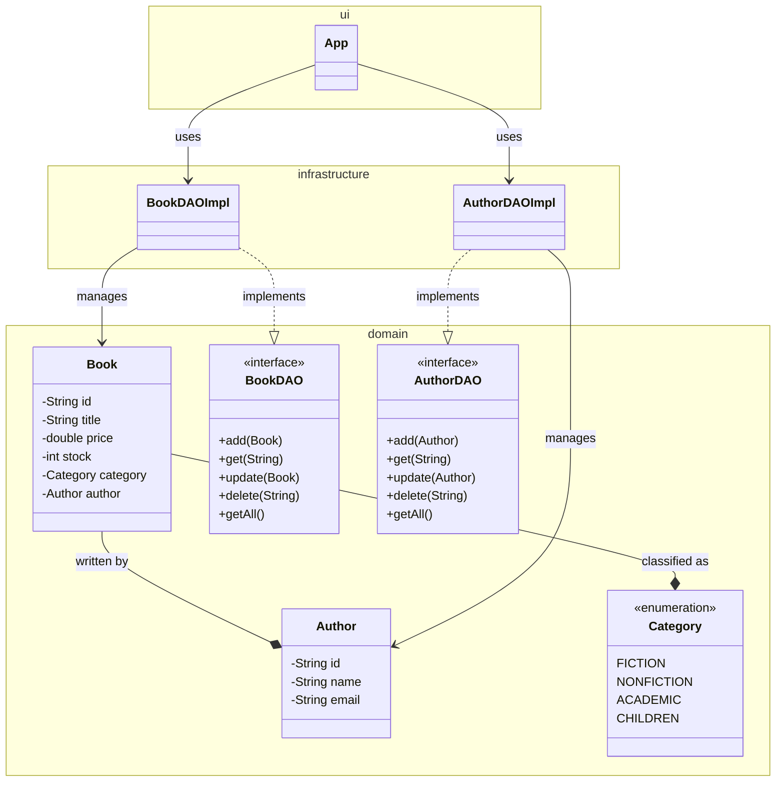

# DAO (Data Access Object)

El patrón **DAO (Data Access Object)** es una técnica de diseño que separa la lógica de acceso a datos del resto de la aplicación. Permite **interactuar con una fuente de datos (BD, archivos, API)** a través de una clase especializada, sin exponer detalles internos.

**Objetivo:** Aislar la lógica de persistencia y hacer que el resto del sistema trabaje con **interfaces limpias y seguras**.

## ¿Por qué usar DAO?

- Cumple el principio de **responsabilidad única** (SRP).
- Facilita **cambiar la fuente de datos** sin alterar la lógica de negocio.
- Mejora la **testabilidad** y el **mantenimiento** del sistema.
- Promueve la **abstracción** y **reutilización del código**.

> Imagina que tienes una base de datos como una biblioteca. Tú no entras directamente al archivo a buscar libros. Usas **un bibliotecario (el DAO)** que sabe cómo acceder al sistema y te entrega lo que pides.

## ¿Qué contiene un DAO?

Una interfaz DAO suele incluir métodos para realizar operaciones CRUD (Crear, Leer, Actualizar, Eliminar), por ejemplo:

|Método|Propósito|
|--|--|
|`add()`|Insertar un nuevo objeto|
|`get()`|Consultar por ID|
|`update()`|Modificar un objeto|
|`delete()`|Eliminar un objeto|
|`getAll()`|Traer todos los objetos|

Opcionalmente podemos incluir búsquedas personalizadas cómo `findByEmail()`, `findByStatus()`, etc.

## Ejemplo de arquitectura básica

LA lógica de acceso a datos se ubica en `infrastructure`, mientras que el `domain` solo conoce la interfaz del DAO.

```txt
edu.usta.domain
  ├── Student.java               ← POJO
  ├── StudentDAO.java            ← Interfaz DAO

edu.usta.infrastructure
  ├── StudentDAOImpl.java        ← Implementación simulada (InMemory)

edu.usta.application
  ├── StudentService.java        ← Lógica de negocio (usa el DAO)

edu.usta.ui
  ├── App.java                   ← Punto de entrada
```

Cuando observamos la interfaz DAO, podríamos estar hablando de código cómo el siguiente:

```java title="StudentDAO.java" showLineNumbers
/**
 * Contract for data access operations related to Student.
 */
public interface StudentDAO {
    void add(Student student);
    Student get(String id);
    void update(Student student);
    void delete(String id);
    List<Student> getAll();
}
```

Al momento de implementar la interfaz en la clase `StudentDAOImpl`, sobrescribimos la lógica de los métodos:

:::note

En estos momentos solo estamos simulando el acceso a los datos a través de la memoria, pero, este tipo de implementación es útil al momento de acceder y manipular datos que se encuentran en una base de datos real.

:::

```java title="StudentDAOImpl.java" showLineNumbers
/**
 * In-memory implementation of the StudentDAO.
 */
public class StudentDAOImpl implements StudentDAO {

    private final Map<String, Student> students = new HashMap<>();

    @Override
    public void add(Student student) {
        students.put(student.getId(), student);
    }

    @Override
    public Student get(String id) {
        return students.get(id);
    }

    @Override
    public void update(Student student) {
        students.put(student.getId(), student);
    }

    @Override
    public void delete(String id) {
        students.remove(id);
    }

    @Override
    public List<Student> getAll() {
        return new ArrayList<>(students.values());
    }
}
```

Al momento de aplicar unit testing, podemos crear una prueba que utilice la clase `StudentDAOImpl` para probar rápidamente el funcionamiento de la misma:

```java title="StudentTest.java" showLineNumbers
import org.junit.jupiter.api.Test;
import static org.junit.jupiter.api.Assertions.*;

public class StudentTest {
    @Test
    void testStudentCRUD() {
        StudentDAO dao = new StudentDAOImpl();
        Student s = new Student("101", "Luis", "luis@usta.edu.co", StudentStatus.ACTIVE);
    
        dao.add(s);
        assertEquals("Luis", dao.get("101").getName());
    
        s.setName("Luis A.");
        dao.update(s);
        assertEquals("Luis A.", dao.get("101").getName());
    
        dao.delete("101");
        assertNull(dao.get("101"));
    }
}
```

## ¿Qué resuelve el patrón DAO?

En una aplicación real, los datos no están “flotando” en memoria. Vienen de alguna fuente como:

- Base de datos relacional (MySQL, PostgreSQL)
- Archivos (JSON, CSV, XML)
- APIs REST o servicios web
- Memoria simulada (para pruebas)

Si **tu clase de lógica de negocio accede directamente a estas fuentes**, queda acoplada. Eso es **difícil de probar, escalar o mantener**.

El patrón DAO se encarga de:

- Separar la lógica de negocio de la lógica de persistencia.
- Definir una interfaz clara y estable para obtener, guardar, modificar y eliminar datos.

## Beneficios del uso de DAO

|Beneficio|Explicación breve|
|--|--|
|Reutilización|El mismo DAO puede usarse en múltiples servicios|
|Testabilidad|Puedes testear con `FakeDAO` o `InMemoryDAO`|
|Escalabilidad|Cambiar a BD real sin afectar el resto del sistema|
|Mantenibilidad|Localizas errores fácilmente en un DAO específico|
|Organización|Tu proyecto se ve profesional, modular y claro|

## Mini-Proyecto: Sistema de Inventario de Librería

Una librería desea desarrollar un sistema para gestionar su inventario y catálogo.

Los usuarios deben poder:

- Registrar nuevos libros.
- Asociar autores a libros.
- Modificar precios y stock.
- Consultar, eliminar y actualizar registros.

### Objetivos del ejercicio

1. Aplicar el patrón DAO para realizar operaciones CRUD sobre varias entidades.
2. Definir interfaces de acceso a datos desacopladas de la lógica del programa.
3. Implementar DAOs con almacenamiento simulado (InMemory) o persistente (si se desea escalar).
4. Aplicar principios de diseño limpio y pruebas unitarias.

### Entidades y relaciones

- `Book` (id, title, price, stock, Author)
- `Author` (id, name, email)
- `Category` (enum: FICTION, NONFICTION, ACADEMIC, CHILDREN)
- `BookDAO` (interfaz) y `BookDAOImpl` (implementación)
- `AuthorDAO` (interfaz) y `AuthorDAOImpl` (implementación)
- `App` (clase principal para pruebas)

> Si tienes conocimiento sobre genéricos, podrás crear solo una interfaz DAO y e implementarla en las clases `BookDAOImpl` y `AuthorDAOImpl`

### Estructura sugerida del proyecto

```txt
domain
  ├── Book.java
  ├── Author.java
  ├── Category.java (enum)
  ├── BookDAO.java
  ├── AuthorDAO.java

infrastructure
  ├── BookDAOImpl.java
  ├── AuthorDAOImpl.java

ui
  ├── App.java
```

### Diagrama de clases



### Requerimientos funcionales

- Registrar un nuevo autor.
- Registrar un libro asociado a un autor.
- Consultar todos los libros por autor.
- Actualizar el precio y stock de un libro.
- Eliminar un libro del inventario.
- Mostrar el catálogo completo.

## Relación con principios SOLID

- SRP (Responsabilidad Única):
  - DAO se encarga solo de guardar y obtener datos.
  - La lógica del negocio vive en otro lugar (como StudentService).
- DIP (Inversión de Dependencias):
  - Tu aplicación depende de una interfaz (StudentDAO), no de la implementación (InMemoryStudentDAO, JDBCStudentDAO, etc.).

## Reflexión final

- Aplicamos los principios **SRP** y **DIP** (la lógica de negocio depende de una interfaz, no de la implementación).
- Facilitamos cambios futuros como:
  - Reemplazar `InMemory` por conexión a base de datos real.
  - Agregar validaciones o logs sin alterar el dominio.
- DAO es un paso natural hacia frameworks como **JPA**, **Hibernate**, **Spring Data**.

## Aplicación práctica

- **Sistemas académicos** (`StudentDAO`, `CourseDAO`)
- **Sistemas bancarios** (`AccountDAO`, `TransactionDAO`)
- **Juegos** (`PlayerDAO`, `ScoreDAO`)

## Referencias

- Oracle. (2024). [Data Access Object Pattern](https://docs.oracle.com/javase/tutorial/jdbc/basics/daopattern.html)
- Baeldung. (2023). [Guide to DAO in Java](https://www.baeldung.com/java-dao-pattern)
- Martin, R. C. (2017). Clean Architecture. Pearson.
