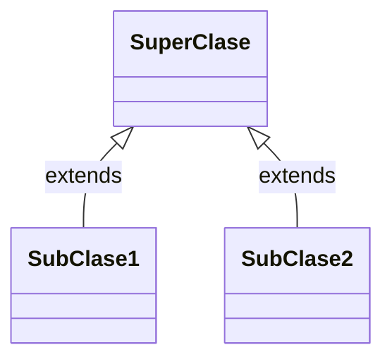
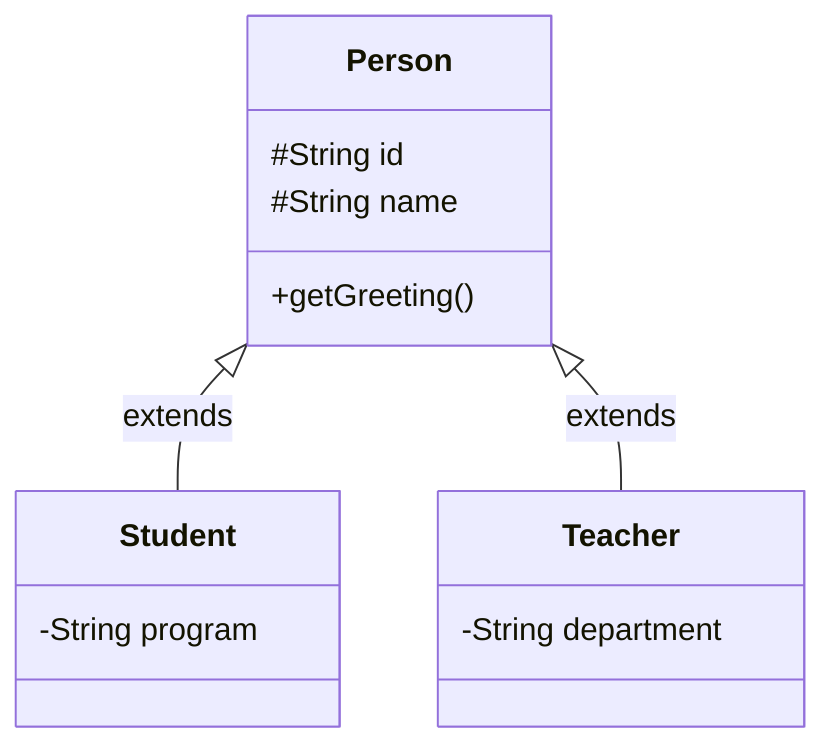
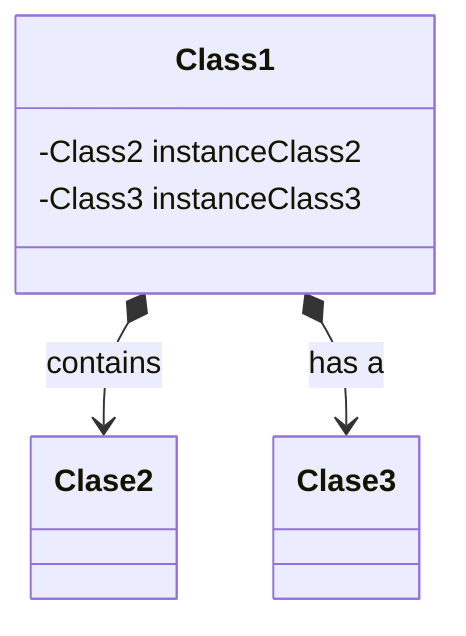
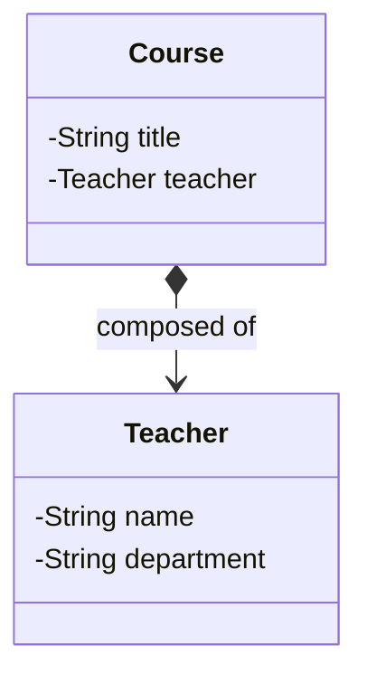
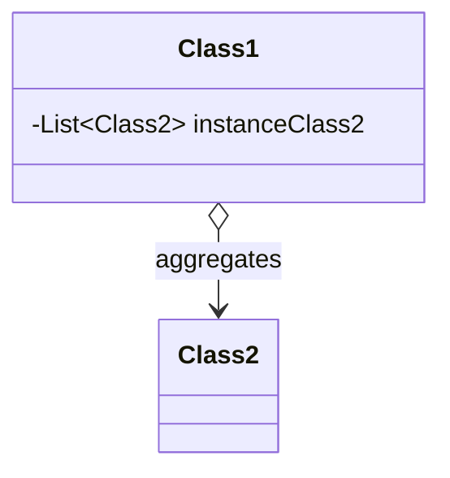
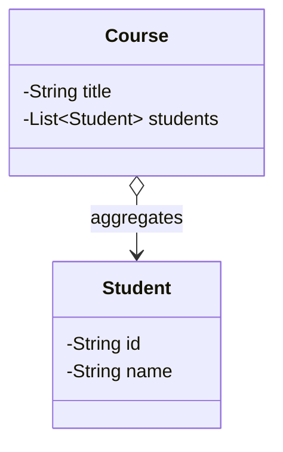

# Herencia, Composición, y Agregación

|Concepto|Definición|
|--|--|
|**Herencia**|Mecanismo donde una clase hereda atributos y métodos de otra (relación “es un”). Ej: `Teacher extends Person`.|
|**Composición**|Relación donde una clase contiene a otra como parte integral (relación “tiene un” con dependencia fuerte). Ej: `Course tiene un Teacher`.|
|**Agregación**|Relación débil donde un objeto contiene otros, pero no depende de ellos para existir. Ej: `Course agrega Student`.|
|**ArrayList**|Lista dinámica ordenada que permite elementos repetidos. Ideal para almacenar colecciones de objetos.|
|**Map** |Estructura que guarda pares clave-valor. Ideal para búsquedas rápidas.|

## ¿Qué es la Herencia?

La **herencia** es un principio fundamental de la Programación Orientada a Objetos que permite a una clase **reutilizar atributos y métodos** de otra clase.

**Definición técnica:** Es el mecanismo mediante el cual una clase hija (subclase) **extiende** a una clase padre (superclase), heredando su comportamiento y permitiendo modificarlo o ampliarlo.

### ¿Cuándo usar herencia?

- Cuando existe una **relación natural “es un”** entre clases.
- Cuando quieres **reutilizar código** común entre varias clases.
- Cuando deseas **crear jerarquías** lógicas de tipos.

### Representación en un diagrama de clases



### Sintaxis básica en Java

```java showLineNumbers
public class Person {
    protected String name;
    protected String id;
}

// highlight-next-line
public class Student extends Person {
    private String program;

    public Student(String name, String id, String program) {
        this.name = name;
        this.id = id;
        this.program = program;
    }
}
```

:::note

En Java, la palabra clave `protected` es un modificador de acceso que **restringe la visibilidad** de campos, métodos y constructores. Un miembro protegido **es accesible dentro de la misma clase, las subclases de esa clase (incluso si están en diferentes paquetes) y cualquier otra clase dentro del mismo paquete**. Esto significa que `protected` ofrece un nivel de acceso más amplio que el modificador de acceso por defecto (`private`), pero más restringido que `public`. En los diagramas de clases se identifica con el símbolo `#`.

:::

- `extends` indica que `Student` **hereda** de `Person`.
- **La subclase accede** a los atributos `protected` de la superclase.
- También puede sobrescribir (`override`) métodos.

### Herencia simple vs. múltiple

- Java solo permite herencia simple de clases (una sola superclase).
- Se puede simular herencia múltiple a través de interfaces.

### Sobrescritura de métodos

```java showLineNumbers
public class Person {
    public String getGreeting() {
        return "Hello!";
    }
}

public class Teacher extends Person {
    // highlight-next-line
    @Override
    public String getGreeting() {
        return "Good morning, class!";
    }
}
```

Esto nos permite **personalizar comportamientos** sin duplicar código.

Piensa en una clase `Vehicle` con métodos como `start()`. Luego tienes subclases `Car`, `Motorcycle`, `Truck`. **Todos comparten características comunes**, pero cada uno puede tener su propia versión de **start()**.

### Ejemplo de herencia simple

import Tabs from "@theme/Tabs";
import TabItem from "@theme/TabItem";

<Tabs>
<TabItem value="diagram" label="Diagrama de clases">



</TabItem>
<TabItem value="java" label="Código">

```java title="Person.java" showLineNumbers
public class Person {
    protected String id
    protected String name

    public String getGreeting() {
        return "Hello!";
    }
}
```

```java title="Student.java" showLineNumbers
// highlight-next-line
public class Student extends Person {
    private String program;

    public Student(String id, String name, String program) {
        this.id = id;
        this.name = name;
        this.program = program;
    }
    
    // highlight-next-line
    @Override
    public String getGreeting() {
        return "Good morning, Teacher!";
    }
}
```

```java title="Teacher.java" showLineNumbers
// highlight-next-line
public class Teacher extends Person {
    private String department;

    public Teacher(String id, String name, String department) {
        this.id = id;
        this.name = name;
        this.department = department;
    }
    
    // highlight-next-line
    @Override
    public String getGreeting() {
        return "Good morning, class!";
    }
}
```

</TabItem>
<TabItem value="java2" label="Test Unitario">

```java title="InheritanceTest.java" showLineNumbers
import org.junit.jupiter.api.Test;
import static org.junit.jupiter.api.Assertions.*;

public class InheritanceTest {
    @Test
    void testInheritanceGreeting() {
        Person student = new Student("Ana", "S001", "Software Engineering");
        assertTrue(student.getGreeting().contains("Hello")); // hereda de Person
    
        Teacher t = new Teacher("Carlos", "T001", "Mathematics");
        assertEquals("Good morning, class!", t.getGreeting());
    }
}
```

</TabItem>
</Tabs>

### Ventajas de la herencia

|Ventaja|Ejemplo|
|--|--|
|Reutilización de código|No necesitas reescribir atributos comunes como `name`, `id`.|
|Organización jerárquica|Las clases se agrupan en estructuras lógicas.|
|Flexibilidad con polimorfismo|Puedes tratar diferentes objetos de la misma forma.|

### Mal uso común de la herencia

- Crear **herencias sin relación conceptual** clara.
- Usar herencia en lugar de composición.
- Tener jerarquías muy profundas o acopladas.

:::tip

Si no puedes decir **“X es un Y”**, probablemente no sea herencia.

:::

## ¿Qué es la Composición?

**Composición** es una relación entre clases donde **una clase contiene a otra como parte de su estructura interna**. Se dice que hay una relación **“tiene un”** o **“está compuesto por”**. Por ejemplo:

- Un `Course` tiene un `Teacher`.
- Un `Car` tiene un `Engine`.

Esto indica que un objeto **usa otro objeto como parte esencial de su funcionamiento**.

### Representación en UML



El **rombo negro (*--)** indica una relación de composición.

### Representación en java de composición

Se declara como un **atributo dentro de la clase**, y se inicializa desde el constructor o por setters.

```java showLineNumbers
public class Teacher {
    private String name;
    private String department;
}

public class Course {
    private String title;
    private Teacher teacher; // composición
}
```

### Características de la composición

|Característica|Explicación|
|--|--|
|Relación “tiene un” (`has-a`)|La clase compuesta **incluye** otra clase|
|Asociación fuerte|Si el objeto externo se destruye, la composición también|
|Promueve encapsulamiento|El objeto contenido es interno y controlado|
|Reemplazo de herencia (en muchos casos)|Permite construir clases complejas sin heredar|

### Diferencia con herencia

|Herencia|Composición|
|--|--|
|Relación “es un”|Relación “tiene un”|
|Usa `extends`|Usa atributos de tipo clase|
|Fuerte acoplamiento|Bajo acoplamiento, más flexible|
|Menos reutilizable|Más flexible y reutilizable|

:::tip

**Prefiere composición sobre herencia** cuando sea posible. (Principio de diseño: Favor composition over inheritance – GoF)

:::

Imagina un Computador. No es un “tipo especial de teclado” (herencia), sino que **tiene un teclado, monitor y CPU** (composición).

### Ejemplo de composición simple

<Tabs>
<TabItem value="diagram" label="Diagrama de clases">



El rombo sólido indica **composición fuerte**: El `Teacher` es parte integral del `Course`, y se puede leer como "Cada curso tiene un docente"

</TabItem>
<TabItem value="java" label="Código">

```java title="Teacher.java" showLineNumbers
public class Teacher{
    private String name;
    private String department;

    public Teacher(String name, String department) {
        this.name = name;
        this.department = department;
    }
}
```

```java title="Course.java" showLineNumbers
public class Course {
    private String title;
    // highlight-next-line
    private Teacher teacher; // Composition
}
```

</TabItem>
<TabItem value="java1" label="Test Unitario">

```java title="CompositionTest.java" showLineNumbers
import org.junit.jupiter.api.Test;
import static org.junit.jupiter.api.Assertions.*;

public class CompositionTest {
    @Test
    void testCourseHasTeacher() {
        Teacher t = new Teacher("Laura", "Mathematics");
        Course c = new Course("Algebra", t);
    
        assertEquals("Laura", c.getTeacher().getName());
    }
}
```

</TabItem>
</Tabs>

### Ventajas de la composición

- **Más flexible que la herencia**
- Se puede **combinar múltiples clases sin jerarquías rígidas**
- Facilita **cambios y mantenimiento**
- Favorece el principio **SRP** (una clase hace una cosa)

## ¿Qué es la Agregación?

La **agregación** es una **relación débil** entre clases donde una clase **contiene o asocia a otras**, pero **no es responsable de su ciclo de vida**.
Se conoce como una relación **“tiene una lista de”** o **“está relacionada con”**, pero los objetos asociados **pueden existir independientemente**.

### Diferencias claves entre Composición y Agregación

|Relación|Vida compartida|Ejemplo|
|--|--|--|
|**Composición**|Sí|`Car` tiene un `Engine`|
|**Agregación**|No|`Course` agrega `Student`s|

### Representación en UML de agregación



El **rombo blanco (o--)** indica una relación de agregación.

### ¿Qué define a la agregación?

- El objeto contiene otros, pero **no los crea ni destruye obligatoriamente**.
- Los objetos agregados **pueden ser compartidos** por varias clases.
- Usa típicamente colecciones como `List`, `Set`, `Map`.

Un `Teacher` puede dictar varios `Courses`. Y un `Student` puede estar inscrito en varios cursos. Si un curso termina, el estudiante sigue existiendo. Esa es una **agregación**.

### Ejemplo de agregación simple

<Tabs>
<TabItem value="diagrama" label="Diagrama de Clases">



</TabItem>
<TabItem value="java1" label="Código en Java">

```java title="Student.java" showLineNumbers
public class Student {
    private String id;
    private String name;

    public Student(String id, String name) {
        this.id = id;
        this.name = name;
    }
}
```

```java title="Course.java" showLineNumbers
public class Course {
    private String title;
    // highlight-next-line
    private List<Student> enrolledStudents = new ArrayList<>(); // Aggregation

    public Course(String title) {
        this.title = title;
    }

    public void addStudent(Student s) {
        enrolledStudents.add(s);
    }
}
```

</TabItem>
<TabItem value="java2" label="Test Unitario">

```java
import org.junit.jupiter.api.Test;
import static org.junit.jupiter.api.Assertions.*;

public class AggregationTest {
    @Test
    void testCourseAggregation() {
        Student s1 = new Student("S01", "Ana");
        Course c = new Course("POO");
    
        c.addStudent(s1);
    
        assertEquals(1, c.getStudents().size());
        assertEquals("Ana", c.getStudents().get(0).getName());
    }
}
```

</TabItem>
</Tabs>

### ¿Por qué es importante aprender agregación?

- Refuerza la **abstracción de relaciones** reales en sistemas.
- Es común al trabajar con **estructuras de datos** (`ArrayList`, `Map`).
- Mejora la comprensión de **modelado de objetos**, especialmente para:
  - Inventarios (`Warehouse` agrega `Products`)
  - Catálogos (`Library` agrega `Books`)
  - Grupos (`Team` agrega `Players`)

### Diferencias entre herencia, composición y agregación

|Aspecto|Herencia|Composición|Agregación|
|------------- |------------------------ |--------------------- |----------------------- |
|Relación|“es un”|“tiene un (parte de)”|“tiene (independiente)”|
|Acoplamiento|Alto|Fuerte|Débil|
|Ciclo de vida|Compartido |Compartido|Independiente|
|Reutilización|Baja|Alta|Alta|
|Ejemplo|`Student extends Person` |`Car has Engine`|`Course has Students`|

## Referencias

- Oracle Docs: [Java Inheritance](https://docs.oracle.com/javase/tutorial/java/IandI/subclasses.html)
- Oracle Docs: [Object Composition](https://docs.oracle.com/javase/tutorial/java/javaOO/objectcreation.html)
- Oracle Java Tutorials: [Object Relationships](https://docs.oracle.com/en/java/javase/24/)
- Baeldung: [Guide to Inheritance in Java](https://www.baeldung.com/java-inheritance)
- Baeldung: [Composition, Aggregation, and Association in Java](https://www.baeldung.com/java-composition-aggregation-association)
- PlantUML: [Aggregation vs Composition](https://plantuml.com/es/class-diagram)
